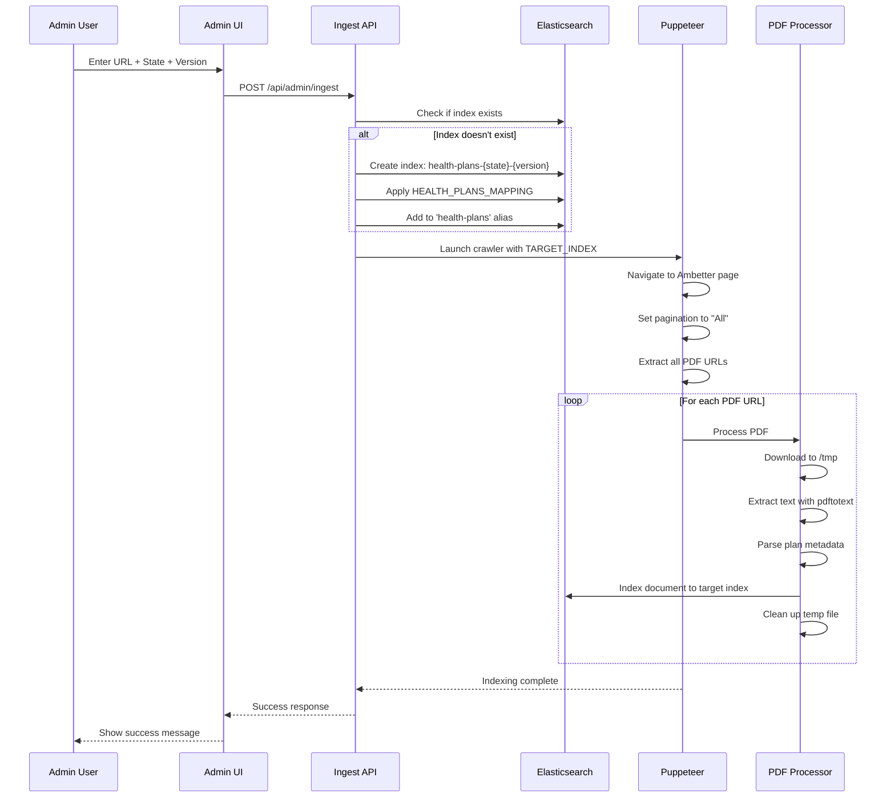

# Ambetter Project - System Architecture & Data Flow

**Version**: 2.1  
**Last Updated**: October 23, 2025  
**Status**: Production

---

## 📋 Table of Contents

1. [Overview](#overview)
2. [Data Ingestion Flow](#data-ingestion-flow)
3. [Search Architecture](#search-architecture)
4. [Index Management](#index-management)
5. [Technology Stack](#technology-stack)

---

## 🎯 Overview

The Ambetter Health Plan Search Application is a full-stack Next.js application that indexes, searches, and manages health plan documents across multiple states using Elasticsearch with dynamic index management and AI-powered search capabilities.

---

## 📥 Data Ingestion Flow

### High-Level Data Pipeline

```
┌─────────────────────────────────────────────────────────────────────┐
│                      ADMIN CREATES NEW INDEX                         │
│                                                                      │
│  User Input: URL + State + Version                                  │
│  Example: ambetter.com/tx/brochures + TX + 2025-10                 │
│                                                                      │
│  ↓ Creates: health-plans-tx-2025-10                                │
└─────────────────────────────────────────────────────────────────────┘
                              ↓
┌─────────────────────────────────────────────────────────────────────┐
│                    STEP 1: WEB CRAWLING                             │
│                                                                      │
│  Tool: Puppeteer (Headless Chrome)                                  │
│                                                                      │
│  1. Navigate to Ambetter state page                                 │
│  2. Detect pagination (select "All" from dropdown)                  │
│  3. Extract all PDF URLs from page                                  │
│  4. Collect metadata (plan names, types, counties)                  │
│                                                                      │
│  Output: List of PDF URLs + metadata                                │
└─────────────────────────────────────────────────────────────────────┘
                              ↓
┌─────────────────────────────────────────────────────────────────────┐
│                   STEP 2: PDF PROCESSING                            │
│                                                                      │
│  Tool: pdftotext (Poppler Utils)                                    │
│                                                                      │
│  For each PDF URL:                                                   │
│    1. Download PDF file → /tmp/temp-{timestamp}.pdf                │
│    2. Extract text → pdftotext -layout                              │
│    3. Parse plan details from text:                                 │
│       • Plan ID (e.g., 29418TX016-2025)                            │
│       • Plan Name (e.g., Ambetter Essential Care)                  │
│       • County Code (e.g., 2941)                                    │
│       • Plan Type (EPO, HMO)                                        │
│    4. Clean up temp files                                           │
│                                                                      │
│  Output: Structured plan documents with extracted text              │
└─────────────────────────────────────────────────────────────────────┘
                              ↓
┌─────────────────────────────────────────────────────────────────────┐
│              STEP 3: ELASTICSEARCH INDEXING                         │
│                                                                      │
│  Target: health-plans-{state}-{version}                            │
│                                                                      │
│  Document Structure:                                                 │
│  {                                                                   │
│    "plan_id": "29418TX016-2025",                                   │
│    "plan_name": "Ambetter Essential Care",                         │
│    "plan_type": "EPO",                                             │
│    "state": "TX",                                                   │
│    "county_code": "2941",                                          │
│    "extracted_text": "full PDF text...",                           │
│    "document_url": "https://...",                                   │
│    "metadata": { ... }                                              │
│  }                                                                   │
│                                                                      │
│  Semantic Fields (ELSER):                                           │
│    • extracted_text_semantic                                        │
│    • body_semantic                                                  │
│    • pdf_semantic                                                   │
└─────────────────────────────────────────────────────────────────────┘
                              ↓
┌─────────────────────────────────────────────────────────────────────┐
│                STEP 4: ALIAS MANAGEMENT                             │
│                                                                      │
│  Add new index to 'health-plans' alias:                            │
│                                                                      │
│  health-plans (alias) →                                             │
│    ├── health-plans-tx-2025-10  (302 docs)                        │
│    ├── health-plans-fl-2025-10  (242 docs)                        │
│    └── health-plans-tx-2025-09  (298 docs)                        │
│                                                                      │
│  ✅ All searches now include new data automatically                │
└─────────────────────────────────────────────────────────────────────┘
```

---

### Detailed Ingestion Sequence



---

## 🔍 Search Architecture

### Search Flow Diagram

```
┌─────────────────────────────────────────────────────────────────────┐
│                        USER SEARCHES                                 │
│                                                                      │
│  User enters: "texas gold plans"                                    │
│  Mode: Semantic or Keyword                                          │
└─────────────────────────────────────────────────────────────────────┘
                              ↓
┌─────────────────────────────────────────────────────────────────────┐
│                  STEP 1: QUERY PROCESSING                           │
│                                                                      │
│  • State Detection: "texas" → filter by state:TX                   │
│  • Load Curations: Check for pinned/excluded docs                   │
│  • Load Boosts: Apply field weights and numeric boosts             │
└─────────────────────────────────────────────────────────────────────┘
                              ↓
┌─────────────────────────────────────────────────────────────────────┐
│                STEP 2: HYBRID SEARCH QUERY                          │
│                                                                      │
│  Elasticsearch Query Components:                                     │
│                                                                      │
│  A. LEXICAL SEARCH (Keyword Matching)                               │
│     • multi_match across text fields                                │
│     • phrase search for exact matches                               │
│     • wildcard search for flexible matching                         │
│                                                                      │
│  B. SEMANTIC SEARCH (ELSER - if enabled)                            │
│     • extracted_text_semantic (boost: 2.0)                          │
│     • body_semantic (boost: 1.5)                                    │
│     • pdf_semantic (boost: 1.5)                                     │
│                                                                      │
│  C. FILTERING                                                        │
│     • State filter: term query on state.keyword                     │
│     • County filter: term query on county_code.keyword              │
│     • Plan type filter: terms query                                 │
│                                                                      │
│  D. DEDUPLICATION                                                    │
│     • Collapse by plan_id.keyword                                   │
│     • Show only unique plans                                        │
│                                                                      │
│  E. BOOSTING                                                         │
│     • Text field weights (configurable)                             │
│     • Numeric boosts (log/sigmoid)                                  │
│     • function_score for custom relevance                           │
└─────────────────────────────────────────────────────────────────────┘
                              ↓
┌─────────────────────────────────────────────────────────────────────┐
│                   STEP 3: RESULT PROCESSING                         │
│                                                                      │
│  1. Apply Curations                                                  │
│     • Pins: Move curated docs to top                                │
│     • Excludes: Remove excluded docs                                │
│                                                                      │
│  2. Extract Plan Names                                               │
│     • Parse plan names from extracted_text                          │
│     • Override with human-readable names                            │
│                                                                      │
│  3. Format Results                                                   │
│     • Add plan metadata                                              │
│     • Include document URLs                                          │
│     • Calculate relevance scores                                     │
└─────────────────────────────────────────────────────────────────────┘
                              ↓
┌─────────────────────────────────────────────────────────────────────┐
│                    STEP 4: FACET GENERATION                         │
│                                                                      │
│  Parallel Aggregation Query:                                        │
│                                                                      │
│  • States: terms agg on state.keyword                               │
│  • Counties: terms agg on county_code.keyword                       │
│  • Plan Types: terms agg on plan_type.keyword                       │
│  • Document Types: terms agg on document_type.keyword               │
│                                                                      │
│  → Contextual facets (filtered by current selections)               │
└─────────────────────────────────────────────────────────────────────┘
                              ↓
┌─────────────────────────────────────────────────────────────────────┐
│                 STEP 5: DISPLAY RESULTS (30/page)                   │
│                                                                      │
│  ┌──────────────────────────────────────────────────────────┐      │
│  │  Filters                    Results                       │      │
│  │  ┌──────────┐              ┌───────────────────────┐     │      │
│  │  │ States   │              │ Plan Name - Plan ID   │     │      │
│  │  │ • TX     │              │ Short description...  │     │      │
│  │  │ • FL     │              │ [View PDF]            │     │      │
│  │  │          │              └───────────────────────┘     │      │
│  │  │ Plan Type│              [Show AI Summary] ←opt-in    │      │
│  │  │ • EPO    │                                            │      │
│  │  │ • HMO    │              (30 results shown)            │      │
│  │  └──────────┘                                            │      │
│  └──────────────────────────────────────────────────────────┘      │
└─────────────────────────────────────────────────────────────────────┘
                              ↓ (optional)
┌─────────────────────────────────────────────────────────────────────┐
│                  STEP 6: AI SUMMARY (OPT-IN)                        │
│                                                                      │
│  User clicks "Show AI Summary"                                      │
│                                                                      │
│  1. Check Redis cache for query hash                                │
│  2. If not cached:                                                   │
│     a. Send top 3 results to OpenAI (gpt-4o-mini)                  │
│     b. Use Ambetter Assistant prompt                                │
│     c. Get personalized plan comparison                             │
│     d. Cache in Redis                                               │
│  3. Display collapsible AI overview                                 │
│     • Plan comparisons                                              │
│     • Trade-offs                                                    │
│     • Source citations                                              │
└─────────────────────────────────────────────────────────────────────┘
```

---

### Search Query Structure

**Example Query for "texas gold plans":**

```json
{
  "from": 0,
  "size": 30,
  "collapse": {
    "field": "plan_id.keyword"
  },
  "_source": [
    "title", "plan_name", "plan_type", "plan_id", 
    "county_code", "extracted_text", "url", "document_url"
  ],
  "query": {
    "bool": {
      "must": [
        {
          "term": { "state.keyword": "TX" }
        }
      ],
      "should": [
        {
          "multi_match": {
            "query": "texas gold plans",
            "fields": [
              "title^2",
              "plan_name^2",
              "state^3",
              "extracted_text^3"
            ],
            "type": "best_fields",
            "fuzziness": "AUTO"
          }
        },
        {
          "multi_match": {
            "query": "texas gold plans",
            "fields": [
              "title^3",
              "plan_name^3",
              "extracted_text^2"
            ],
            "type": "phrase"
          }
        },
        {
          "semantic": {
            "field": "extracted_text_semantic",
            "query": "texas gold plans",
            "boost": 2.0
          }
        }
      ],
      "minimum_should_match": 1
    }
  }
}
```

---

## 🗄️ Index Management

### Multi-Index Architecture

```
┌─────────────────────────────────────────────────────────────────────┐
│                    ELASTICSEARCH INDICES                             │
│                                                                      │
│  Physical Indices (State + Version):                                │
│  ┌────────────────────────────────────────────────────────┐        │
│  │  health-plans-tx-2025-10        302 docs    15MB      │        │
│  │  health-plans-fl-2025-10        242 docs    12MB      │        │
│  │  health-plans-tx-2025-09        298 docs    14MB      │        │
│  │  health-plans-ca-2025-11        450 docs    22MB      │        │
│  └────────────────────────────────────────────────────────┘        │
│                          ↓ ↓ ↓                                      │
│  Alias (Logical View):                                              │
│  ┌────────────────────────────────────────────────────────┐        │
│  │  health-plans (alias)                                  │        │
│  │  → Searches across ALL indices automatically           │        │
│  │  → Total: 1,292 documents, 63MB                       │        │
│  └────────────────────────────────────────────────────────┘        │
└─────────────────────────────────────────────────────────────────────┘
```

### Index Lifecycle

```
┌─────────────────────────────────────────────────────────────────────┐
│                     INDEX LIFECYCLE                                  │
│                                                                      │
│  1. CREATE (Admin UI)                                               │
│     User: TX + 2025-10 → Creates health-plans-tx-2025-10          │
│     ↓                                                                │
│     Apply mapping, add to alias                                     │
│                                                                      │
│  2. INGEST                                                          │
│     Crawl URLs → Extract PDFs → Index documents                    │
│     ↓                                                                │
│     Index populated with plan data                                  │
│                                                                      │
│  3. ACTIVE USE                                                      │
│     Included in all searches via 'health-plans' alias              │
│     ↓                                                                │
│     Users search across all states/versions                         │
│                                                                      │
│  4. UPDATE (Optional)                                               │
│     Create new version: health-plans-tx-2025-11                    │
│     ↓                                                                │
│     Add to alias, optionally remove old version                     │
│                                                                      │
│  5. ARCHIVE/DELETE (Admin UI)                                       │
│     Remove from alias → Delete index                                │
│     ↓                                                                │
│     Old data cleaned up                                             │
└─────────────────────────────────────────────────────────────────────┘
```

### Admin Index Management UI

```
┌─────────────────────────────────────────────────────────────────────┐
│  Admin Dashboard → Indices Tab                                      │
│                                                                      │
│  ┌────────────────────────────────────────────────────────────┐    │
│  │ Index Name             Docs  Size  Created    Status  Actions│  │
│  ├────────────────────────────────────────────────────────────┤    │
│  │ health-plans-tx-2025-10 302  15MB  10/15/25  🟢 [ALIAS]    │  │
│  │                                                    │           │  │
│  │                          [Remove Alias] [Delete]  │           │  │
│  ├────────────────────────────────────────────────────────────┤    │
│  │ health-plans-fl-2025-10 242  12MB  10/18/25  🟢 [ALIAS]    │  │
│  │                          [Remove Alias] [Delete]              │  │
│  ├────────────────────────────────────────────────────────────┤    │
│  │ health-plans-tx-2025-09 298  14MB  09/01/25  🟢           │  │
│  │                          [Add Alias] [Delete]                 │  │
│  └────────────────────────────────────────────────────────────┘    │
│                                                                      │
│  Features:                                                          │
│  • View all indices matching health-plans-*                        │
│  • See which indices are in the active alias                       │
│  • Add/remove indices from alias without deletion                  │
│  • Delete old/obsolete indices with confirmation                   │
│  • Monitor health status (green/yellow/red)                        │
└─────────────────────────────────────────────────────────────────────┘
```

---

## 🛠️ Technology Stack

### Architecture Overview

```
┌─────────────────────────────────────────────────────────────────────┐
│                        FRONTEND LAYER                                │
│                                                                      │
│  Next.js 14 (React 18 + TypeScript)                                │
│  • App Router (Server/Client Components)                            │
│  • Inline Styles (No CSS frameworks)                                │
│  • Client-side state management (useState, useEffect)              │
│                                                                      │
│  Pages:                                                              │
│  • / (Homepage - Search bar)                                        │
│  • /search (Results + Filters + AI Summary)                        │
│  • /admin (Index Management, Curations, Boosting)                  │
└─────────────────────────────────────────────────────────────────────┘
                              ↓ HTTP/REST
┌─────────────────────────────────────────────────────────────────────┐
│                      API ROUTES LAYER                               │
│                                                                      │
│  Next.js API Routes (Serverless Functions)                          │
│                                                                      │
│  Search & Data:                                                     │
│  • POST /api/search        → Hybrid search with filters            │
│  • GET  /api/facets        → Aggregations for filters              │
│  • POST /api/ai-summary    → OpenAI GPT-4o-mini summary            │
│                                                                      │
│  Admin:                                                              │
│  • POST /api/admin/ingest  → Trigger ingestion                     │
│  • GET  /api/admin/indices → List all indices                      │
│  • DELETE /api/admin/indices/:name → Delete index                  │
│  • POST /api/admin/aliases → Add/remove alias                      │
│  • GET/POST /api/admin/curations → Search curations               │
│  • GET/POST /api/admin/boosts → Field boosting config             │
└─────────────────────────────────────────────────────────────────────┘
                              ↓
┌─────────────────────────────────────────────────────────────────────┐
│                       DATA LAYER                                     │
│                                                                      │
│  ┌──────────────────────────────────────────────────────┐          │
│  │  Elasticsearch Cloud Serverless                       │          │
│  │  • Primary data store                                 │          │
│  │  • health-plans alias → Multiple indices              │          │
│  │  • ELSER semantic search                              │          │
│  │  • Aggregations for facets                            │          │
│  └──────────────────────────────────────────────────────┘          │
│                                                                      │
│  ┌──────────────────────────────────────────────────────┐          │
│  │  Upstash Redis                                        │          │
│  │  • LLM response caching                               │          │
│  │  • Key: query hash                                    │          │
│  │  • TTL: configurable                                  │          │
│  └──────────────────────────────────────────────────────┘          │
│                                                                      │
│  ┌──────────────────────────────────────────────────────┐          │
│  │  OpenAI API                                           │          │
│  │  • Model: gpt-4o-mini                                 │          │
│  │  • AI summaries and plan comparisons                  │          │
│  │  • Ambetter Assistant prompt                          │          │
│  └──────────────────────────────────────────────────────┘          │
└─────────────────────────────────────────────────────────────────────┘
                              ↓
┌─────────────────────────────────────────────────────────────────────┐
│                    INGESTION LAYER                                   │
│                                                                      │
│  ┌──────────────────────────────────────────────────────┐          │
│  │  Puppeteer (Node.js)                                  │          │
│  │  • Headless Chrome automation                         │          │
│  │  • PDF URL extraction                                 │          │
│  │  • Dynamic pagination handling                        │          │
│  └──────────────────────────────────────────────────────┘          │
│                                                                      │
│  ┌──────────────────────────────────────────────────────┐          │
│  │  pdftotext (Poppler Utils)                            │          │
│  │  • PDF text extraction                                │          │
│  │  • Layout preservation                                │          │
│  │  • High accuracy                                      │          │
│  └──────────────────────────────────────────────────────┘          │
│                                                                      │
│  Scripts:                                                            │
│  • multi-state-processor.js → Orchestrates ingestion               │
│  • pdf-processor logic → Extracts and indexes                      │
└─────────────────────────────────────────────────────────────────────┘
```

### Key Technologies

| Component | Technology | Purpose |
|-----------|-----------|---------|
| **Frontend Framework** | Next.js 14 | Full-stack React framework with SSR/SSG |
| **Language** | TypeScript | Type-safe development |
| **Search Engine** | Elasticsearch Cloud | Hybrid search, aggregations, ELSER semantic |
| **Semantic Search** | ELSER (Elastic) | Contextual understanding without embeddings |
| **AI Summary** | OpenAI GPT-4o-mini | Intelligent plan comparisons |
| **Caching** | Upstash Redis | LLM response caching |
| **Web Scraping** | Puppeteer | PDF URL extraction from dynamic pages |
| **PDF Processing** | pdftotext | Text extraction from PDFs |
| **Deployment** | Vercel | Serverless deployment with CI/CD |
| **Version Control** | Git + GitHub | Source code management |

---

## 📊 Data Flow Summary

### Complete End-to-End Flow

```
[Admin Creates Index] 
    → [health-plans-{state}-{version}]
        → [Web Crawling: Puppeteer extracts PDF URLs]
            → [PDF Processing: pdftotext extracts text]
                → [Elasticsearch Indexing: Documents stored]
                    → [Alias Management: Added to health-plans alias]
                        → [User Searches: Queries alias]
                            → [Hybrid Search: Lexical + Semantic]
                                → [Result Processing: Curations + Boosts]
                                    → [Display Results: 30/page with filters]
                                        → [Optional: AI Summary via OpenAI]
                                            → [Cached in Redis for reuse]
```

---

## 🔗 Related Documentation

- **[PROJECT_MASTER.md](./PROJECT_MASTER.md)** - Complete project documentation
- **[DEPLOYMENT.md](./docs/DEPLOYMENT.md)** - Vercel deployment guide  
- **[CODING_STANDARDS.md](./CODING_STANDARDS.md)** - Development guidelines

---

**Last Updated**: October 23, 2025  
**Maintained By**: Development Team

---

