```mermaid
sequenceDiagram
    participant Admin as Admin User
    participant UI as Admin UI
    participant API as Ingest API
    participant ES as Elasticsearch
    participant Puppeteer as Puppeteer
    participant PDF as PDF Processor

    Admin->>UI: Enter URL + State + Version
    UI->>API: POST /api/admin/ingest
    
    API->>ES: Check if index exists
    alt Index doesn't exist
        API->>ES: Create index: health-plans-{state}-{version}
        API->>ES: Apply HEALTH_PLANS_MAPPING
        API->>ES: Add to 'health-plans' alias
    end
    
    API->>Puppeteer: Launch crawler with TARGET_INDEX
    Puppeteer->>Puppeteer: Navigate to Ambetter page
    Puppeteer->>Puppeteer: Set pagination to "All"
    Puppeteer->>Puppeteer: Extract all PDF URLs
    
    loop For each PDF URL
        Puppeteer->>PDF: Process PDF
        PDF->>PDF: Download to /tmp
        PDF->>PDF: Extract text with pdftotext
        PDF->>PDF: Parse plan metadata
        PDF->>ES: Index document to target index
        PDF->>PDF: Clean up temp file
    end
    
    Puppeteer-->>API: Indexing complete
    API-->>UI: Success response
    UI-->>Admin: Show success message
```

# Ambetter Project - System Architecture & Data Flow

**Version**: 2.1  
**Last Updated**: October 23, 2025  
**Status**: Production

---

## 📋 Table of Contents

1. [Overview](#overview)
2. [Data Ingestion Flow](#data-ingestion-flow)
3. [Search Architecture](#search-architecture)
4. [Index Management](#index-management)
5. [Technology Stack](#technology-stack)

---

## 🎯 Overview

The Ambetter Health Plan Search Application is a full-stack Next.js application that indexes, searches, and manages health plan documents across multiple states using Elasticsearch with dynamic index management and AI-powered search capabilities.

---

## 📥 Data Ingestion Flow

### High-Level Data Pipeline


### Detailed Ingestion Sequence


---

### Detailed Ingestion Sequence



---

## 🔍 Search Architecture

### Search Flow Diagram


### Search Query Processing Flow


---

### Search Query Structure

**Example Query for "texas gold plans":**

```json
{
  "from": 0,
  "size": 30,
  "collapse": {
    "field": "plan_id.keyword"
  },
  "_source": [
    "title", "plan_name", "plan_type", "plan_id", 
    "county_code", "extracted_text", "url", "document_url"
  ],
  "query": {
    "bool": {
      "must": [
        {
          "term": { "state.keyword": "TX" }
        }
      ],
      "should": [
        {
          "multi_match": {
            "query": "texas gold plans",
            "fields": [
              "title^2",
              "plan_name^2",
              "state^3",
              "extracted_text^3"
            ],
            "type": "best_fields",
            "fuzziness": "AUTO"
          }
        },
        {
          "multi_match": {
            "query": "texas gold plans",
            "fields": [
              "title^3",
              "plan_name^3",
              "extracted_text^2"
            ],
            "type": "phrase"
          }
        },
        {
          "semantic": {
            "field": "extracted_text_semantic",
            "query": "texas gold plans",
            "boost": 2.0
          }
        }
      ],
      "minimum_should_match": 1
    }
  }
}
```

---

## 🗄️ Index Management

### Multi-Index Architecture

```mermaid
graph TB
    subgraph "Physical Indices (State + Version)"
        A[health-plans-tx-2025-10<br/>302 docs • 15MB]
        B[health-plans-fl-2025-10<br/>242 docs • 12MB]
        C[health-plans-tx-2025-09<br/>298 docs • 14MB]
        D[health-plans-ca-2025-11<br/>450 docs • 22MB]
    end
    
    subgraph "Alias (Logical View)"
        E[health-plans alias<br/>Searches across ALL indices<br/>Total: 1,292 documents • 63MB]
    end
    
    A --> E
    B --> E
    C --> E
    D --> E
    
    style A fill:#e3f2fd
    style B fill:#e8f5e8
    style C fill:#fff3e0
    style D fill:#fce4ec
    style E fill:#f3e5f5
```



### Index Lifecycle


### Admin Index Management Flow


### Admin Index Management UI

```
┌─────────────────────────────────────────────────────────────────────┐
│  Admin Dashboard → Indices Tab                                      │
│                                                                      │
│  ┌────────────────────────────────────────────────────────────┐    │
│  │ Index Name             Docs  Size  Created    Status  Actions│  │
│  ├────────────────────────────────────────────────────────────┤    │
│  │ health-plans-tx-2025-10 302  15MB  10/15/25  🟢 [ALIAS]    │  │
│  │                                                    │           │  │
│  │                          [Remove Alias] [Delete]  │           │  │
│  ├────────────────────────────────────────────────────────────┤    │
│  │ health-plans-fl-2025-10 242  12MB  10/18/25  🟢 [ALIAS]    │  │
│  │                          [Remove Alias] [Delete]              │  │
│  ├────────────────────────────────────────────────────────────┤    │
│  │ health-plans-tx-2025-09 298  14MB  09/01/25  🟢           │  │
│  │                          [Add Alias] [Delete]                 │  │
│  └────────────────────────────────────────────────────────────┘    │
│                                                                      │
│  Features:                                                          │
│  • View all indices matching health-plans-*                        │
│  • See which indices are in the active alias                       │
│  • Add/remove indices from alias without deletion                  │
│  • Delete old/obsolete indices with confirmation                   │
│  • Monitor health status (green/yellow/red)                        │
└─────────────────────────────────────────────────────────────────────┘
```

---

## 🛠️ Technology Stack

### System Architecture Flow

```mermaid
graph TB
    subgraph "Frontend Layer"
        A[Next.js 14 App Router]
        B[React 18 + TypeScript]
        C[Inline Styles]
        D[Client State Management]
        
        subgraph "Pages"
            E[/ - Homepage Search]
            F[/search - Results + Filters]
            G[/admin - Management Panel]
        end
    end
    
    subgraph "API Routes Layer"
        H[Next.js API Routes]
        
        subgraph "Search & Data APIs"
            I[POST /api/search]
            J[GET /api/facets]
            K[POST /api/ai-summary]
        end
        
        subgraph "Admin APIs"
            L[POST /api/admin/ingest]
            M[GET /api/admin/indices]
            N[DELETE /api/admin/indices/:name]
            O[POST /api/admin/aliases]
            P[GET/POST /api/admin/curations]
            Q[GET/POST /api/admin/boosts]
        end
    end
    
    subgraph "Data Layer"
        R[Elasticsearch Cloud Serverless]
        S[Upstash Redis Cache]
        T[OpenAI API]
        
        subgraph "Elasticsearch Features"
            R1[health-plans alias]
            R2[Multiple indices]
            R3[ELSER semantic search]
            R4[Aggregations for facets]
        end
        
        subgraph "Redis Features"
            S1[LLM response caching]
            S2[Query hash keys]
            S3[Configurable TTL]
        end
        
        subgraph "OpenAI Features"
            T1[gpt-4o-mini model]
            T2[AI summaries]
            T3[Plan comparisons]
            T4[Ambetter Assistant prompt]
        end
    end
    
    subgraph "Ingestion Layer"
        U[Puppeteer Node.js]
        V[pdftotext Poppler Utils]
        W[Processing Scripts]
        
        subgraph "Puppeteer Features"
            U1[Headless Chrome automation]
            U2[PDF URL extraction]
            U3[Dynamic pagination]
        end
        
        subgraph "PDF Processing"
            V1[Text extraction]
            V2[Layout preservation]
            V3[High accuracy]
        end
        
        subgraph "Scripts"
            W1[multi-state-processor.js]
            W2[pdf-processor logic]
        end
    end
    
    A --> H
    B --> H
    C --> H
    D --> H
    
    E --> I
    F --> I
    F --> J
    F --> K
    G --> L
    G --> M
    G --> N
    G --> O
    G --> P
    G --> Q
    
    I --> R
    J --> R
    K --> S
    K --> T
    L --> U
    L --> V
    L --> W
    
    R --> R1
    R --> R2
    R --> R3
    R --> R4
    
    S --> S1
    S --> S2
    S --> S3
    
    T --> T1
    T --> T2
    T --> T3
    T --> T4
    
    U --> U1
    U --> U2
    U --> U3
    
    V --> V1
    V --> V2
    V --> V3
    
    W --> W1
    W --> W2
    
    style A fill:#e3f2fd
    style H fill:#f3e5f5
    style R fill:#e8f5e8
    style S fill:#fff3e0
    style T fill:#fce4ec
    style U fill:#fff8e1
    style V fill:#f1f8e9
    style W fill:#fafafa
```

### Component Interaction Flow


### Key Technologies

| Component | Technology | Purpose |
|-----------|-----------|---------|
| **Frontend Framework** | Next.js 14 | Full-stack React framework with SSR/SSG |
| **Language** | TypeScript | Type-safe development |
| **Search Engine** | Elasticsearch Cloud | Hybrid search, aggregations, ELSER semantic |
| **Semantic Search** | ELSER (Elastic) | Contextual understanding without embeddings |
| **AI Summary** | OpenAI GPT-4o-mini | Intelligent plan comparisons |
| **Caching** | Upstash Redis | LLM response caching |
| **Web Scraping** | Puppeteer | PDF URL extraction from dynamic pages |
| **PDF Processing** | pdftotext | Text extraction from PDFs |
| **Deployment** | Vercel | Serverless deployment with CI/CD |
| **Version Control** | Git + GitHub | Source code management |

---

## 📊 Data Flow Summary

### Complete End-to-End Flow


### System Data Flow Diagram


---

## 🔗 Related Documentation

- **[PROJECT_MASTER.md](./PROJECT_MASTER.md)** - Complete project documentation
- **[DEPLOYMENT.md](./docs/DEPLOYMENT.md)** - Vercel deployment guide  
- **[CODING_STANDARDS.md](./CODING_STANDARDS.md)** - Development guidelines

---

**Last Updated**: October 23, 2025  
**Maintained By**: Development Team

---

