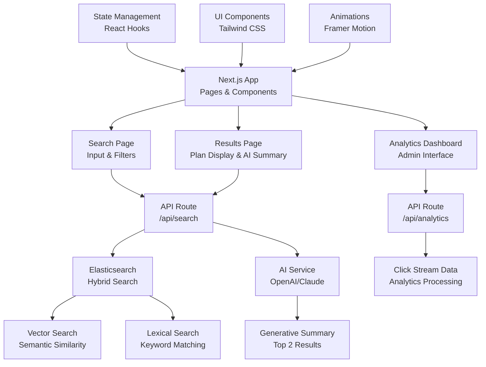

# Phase 2 Requirements - Search Interface Development

## 🎯 Phase 2 Overview

**Objective**: Build a comprehensive Next.js search application with advanced search capabilities, AI-powered summaries, and analytics dashboard.

**Status**: Ready to begin (Phase 1 completed with 160 documents indexed)

---

## 🏗️ **Phase 2 Architecture**

### System Architecture


---

## 🎨 **Frontend Development (Next.js)**

### 1. Search Interface Components

#### **Search Page (`/search`)**
- **Search Input Component**
  - Auto-complete suggestions
  - Search term highlighting
  - Recent searches history
  - Voice search capability (optional)

- **Filter Components**
  - County selector (dropdown with 2941 county)
  - Plan type filter (TX014, TX016, TX017)
  - Document type filter (SBC, EOC, OOC, Brochure, Policy, Disclosure)
  - Tobacco use filter (Yes/No/Any)
  - Date range filter (if applicable)

- **Search Results Preview**
  - Real-time search suggestions
  - Result count display
  - Quick preview cards

#### **Results Page (`/results`)**
- **Search Results Display**
  - Paginated results (10-20 per page)
  - Result ranking with relevance scores
  - Plan cards with key information
  - PDF download links
  - Plan comparison feature

- **AI-Powered Summary**
  - Generative summary of top 2 results
  - Context highlighting of search terms
  - Plan value propositions
  - Eligibility information
  - Coverage highlights

- **Advanced Features**
  - Sort by relevance, plan type, county
  - Export results to PDF/CSV
  - Save searches and results
  - Share results functionality

#### **Analytics Dashboard (`/admin`)**
- **Search Analytics**
  - Popular search terms
  - Search frequency trends
  - Click-through rates
  - User behavior patterns

- **Plan Performance**
  - Most clicked plans
  - Plan popularity by county
  - Document type preferences
  - Performance metrics

- **Admin Controls**
  - Plan boosting interface
  - Search term management
  - Analytics configuration
  - System monitoring

### 2. UI/UX Requirements

#### **Design System**
- **Color Scheme**: Match Ambetter's brand colors
- **Typography**: Clean, readable fonts
- **Layout**: Responsive grid system
- **Components**: Reusable UI components
- **Icons**: Consistent icon library

#### **Responsive Design**
- **Mobile**: Touch-friendly interface
- **Tablet**: Optimized for medium screens
- **Desktop**: Full-featured experience
- **Accessibility**: WCAG 2.1 compliance

#### **User Experience**
- **Loading States**: Skeleton screens and progress indicators
- **Error Handling**: User-friendly error messages
- **Empty States**: Helpful empty state designs
- **Animations**: Smooth transitions and micro-interactions

---

## 🔍 **Search Capabilities**

### 1. Hybrid Search Implementation

#### **Vector Search (Semantic)**
- **Elasticsearch Dense Vector Search**
  - Use existing `semantic_vector` fields
  - Cosine similarity scoring
  - Context-aware search results
  - Multi-language support (if needed)

#### **Lexical Search (Keyword)**
- **Traditional Text Search**
  - Keyword matching in `extracted_text`, `title`, `body`
  - Fuzzy matching for typos
  - Phrase search capabilities
  - Boolean search operators

#### **Hybrid Search Algorithm**
- **Combined Scoring**
  - Weighted combination of vector and lexical scores
  - Configurable weight ratios
  - Relevance boosting
  - Plan-specific boosting

### 2. Advanced Search Features

#### **Faceted Search**
- **Dynamic Filters**
  - Real-time filter updates
  - Filter combination logic
  - Clear all filters
  - Filter persistence in URL

#### **Auto-complete**
- **Search Suggestions**
  - Plan name suggestions
  - County name suggestions
  - Document type suggestions
  - Recent search history

#### **Search Analytics**
- **Query Tracking**
  - Search term logging
  - Result click tracking
  - Search success metrics
  - User session tracking

---

## 🤖 **AI Integration**

### 1. Generative AI Summaries

#### **OpenAI/Claude Integration**
- **Summary Generation**
  - Top 2 results summarization
  - Context-aware content
  - Plan value highlighting
  - Eligibility information extraction

#### **Prompt Engineering**
- **Structured Prompts**
  - Plan comparison templates
  - Value proposition extraction
  - Coverage summary generation
  - Eligibility requirement parsing

#### **AI Response Processing**
- **Content Validation**
  - Fact-checking against source documents
  - Consistency verification
  - Error handling for AI failures
  - Fallback to manual summaries

### 2. AI-Powered Features

#### **Smart Search Suggestions**
- **Query Enhancement**
  - Search term suggestions
  - Related query recommendations
  - Intent recognition
  - Query expansion

#### **Content Analysis**
- **Document Understanding**
  - Key information extraction
  - Coverage analysis
  - Benefit identification
  - Cost structure parsing

---

## 🔧 **Backend API Development**

### 1. API Routes (`/api/`)

#### **Search API (`/api/search`)**
```typescript
POST /api/search
{
  query: string,
  filters: {
    county?: string,
    planType?: string[],
    documentType?: string[],
    tobaccoUse?: boolean
  },
  page?: number,
  limit?: number,
  sortBy?: 'relevance' | 'planType' | 'county'
}
```

#### **Analytics API (`/api/analytics`)**
```typescript
GET /api/analytics/search-terms
GET /api/analytics/click-rates
GET /api/analytics/plan-performance
POST /api/analytics/track-search
POST /api/analytics/track-click
```

#### **Plan Management API (`/api/plans`)**
```typescript
GET /api/plans/:id
PUT /api/plans/:id/boost
GET /api/plans/stats
POST /api/plans/compare
```

### 2. Search Service Implementation

#### **Elasticsearch Integration**
- **Query Building**
  - Dynamic query construction
  - Filter application
  - Sorting and pagination
  - Aggregation queries

#### **Search Optimization**
- **Performance Tuning**
  - Query caching
  - Result caching
  - Index optimization
  - Response time monitoring

#### **Error Handling**
- **Robust Error Management**
  - Elasticsearch connection errors
  - Query timeout handling
  - Fallback search strategies
  - User-friendly error messages

---

## 📊 **Analytics & Monitoring**

### 1. Click Stream Analytics

#### **Event Tracking**
- **Search Events**
  - Query terms
  - Filter usage
  - Result clicks
  - Session duration

- **User Behavior**
  - Page views
  - Time on page
  - Bounce rate
  - Conversion tracking

#### **Data Collection**
- **Real-time Processing**
  - Event streaming
  - Data validation
  - Storage optimization
  - Privacy compliance

### 2. Performance Monitoring

#### **Search Performance**
- **Response Times**
  - API response monitoring
  - Elasticsearch query performance
  - Frontend rendering times
  - User experience metrics

#### **System Health**
- **Infrastructure Monitoring**
  - Server resource usage
  - Database performance
  - Error rate tracking
  - Uptime monitoring

---

## 🚀 **Implementation Plan**

### **Sprint 1: Core Search Interface (Week 1-2)**
- [ ] Set up Next.js project structure
- [ ] Create basic search page with input and filters
- [ ] Implement Elasticsearch search API
- [ ] Build results display component
- [ ] Add basic styling with Tailwind CSS

### **Sprint 2: Advanced Search Features (Week 3-4)**
- [ ] Implement hybrid search (vector + lexical)
- [ ] Add faceted search functionality
- [ ] Create auto-complete suggestions
- [ ] Build search analytics tracking
- [ ] Add result sorting and pagination

### **Sprint 3: AI Integration (Week 5-6)**
- [ ] Integrate OpenAI/Claude API
- [ ] Implement generative summaries
- [ ] Add AI-powered search suggestions
- [ ] Create content analysis features
- [ ] Build AI response validation

### **Sprint 4: Analytics Dashboard (Week 7-8)**
- [ ] Create admin dashboard
- [ ] Implement click stream analytics
- [ ] Build plan performance metrics
- [ ] Add plan boosting interface
- [ ] Create analytics visualizations

### **Sprint 5: Polish & Optimization (Week 9-10)**
- [ ] Performance optimization
- [ ] Mobile responsiveness
- [ ] Accessibility improvements
- [ ] Error handling enhancement
- [ ] Documentation completion

---

## 📋 **Technical Requirements**

### **Dependencies**
```json
{
  "dependencies": {
    "next": "^14.0.0",
    "react": "^18.0.0",
    "typescript": "^5.0.0",
    "tailwindcss": "^3.0.0",
    "@elastic/elasticsearch": "^8.0.0",
    "openai": "^4.0.0",
    "@anthropic-ai/sdk": "^0.0.0",
    "framer-motion": "^10.0.0",
    "react-hook-form": "^7.0.0",
    "zustand": "^4.0.0"
  }
}
```

### **Environment Variables**
```env
# Elasticsearch
ELASTIC_ENDPOINT=https://centene-serverless-demo-a038f2.es.us-east-1.aws.elastic.cloud
ELASTIC_API_KEY=your_api_key

# AI Services
OPENAI_API_KEY=your_openai_key
ANTHROPIC_API_KEY=your_anthropic_key

# Application
NEXT_PUBLIC_APP_URL=http://localhost:3000
NODE_ENV=development
```

### **File Structure**
```
src/
├── app/                    # Next.js 14 app router
│   ├── search/            # Search page
│   ├── results/           # Results page
│   ├── admin/             # Analytics dashboard
│   └── api/               # API routes
├── components/            # Reusable components
│   ├── search/           # Search components
│   ├── results/          # Results components
│   └── ui/               # UI components
├── lib/                   # Utility libraries
│   ├── elasticsearch.ts  # ES client
│   ├── ai.ts             # AI service
│   └── analytics.ts      # Analytics
└── types/                 # TypeScript types
```

---

## ✅ **Success Criteria**

### **Functional Requirements**
- [ ] Users can search health plans with natural language
- [ ] Search results show relevant plans with AI summaries
- [ ] Filters work correctly for all plan attributes
- [ ] Analytics dashboard shows search and click metrics
- [ ] Plan boosting functionality works as expected

### **Performance Requirements**
- [ ] Search response time < 2 seconds
- [ ] Page load time < 3 seconds
- [ ] Mobile responsiveness across all devices
- [ ] 99.9% uptime for search functionality

### **Quality Requirements**
- [ ] Code follows established coding standards
- [ ] Comprehensive error handling
- [ ] Accessibility compliance (WCAG 2.1)
- [ ] Security best practices implemented
- [ ] Comprehensive documentation

---

## 🎯 **Phase 2 Deliverables**

1. **Next.js Search Application**
   - Complete search interface
   - Results page with AI summaries
   - Analytics dashboard
   - Mobile-responsive design

2. **Backend API Services**
   - Search API with hybrid search
   - Analytics tracking API
   - Plan management API
   - AI integration services

3. **Documentation**
   - API documentation
   - Component documentation
   - Deployment guide
   - User guide

4. **Testing & Validation**
   - Unit tests for components
   - Integration tests for APIs
   - End-to-end testing
   - Performance testing

---

**Ready to begin Phase 2 development!** 🚀
