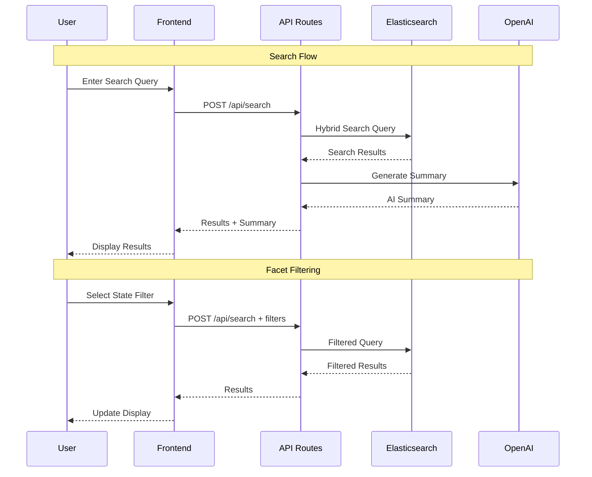

# Ambetter Health Plan Search Application
## Complete Project Documentation & Requirements

**Version**: 2.0 (Multi-State)  
**Last Updated**: October 22, 2025  
**Status**: Phase 1 Complete ✅ | Phase 2 In Progress 🚀

---

## 📋 Table of Contents

1. [Project Overview](#project-overview)
2. [Current Status](#current-status)
3. [System Architecture](#system-architecture)
4. [Phase 1: Data Foundation](#phase-1-data-foundation-completed-)
5. [Phase 2: Search Interface](#phase-2-search-interface-in-progress-)
6. [Technical Stack](#technical-stack)
7. [Multi-State Setup](#multi-state-setup)
8. [Deployment Guide](#deployment-guide)
9. [API Documentation](#api-documentation)
10. [Development Workflow](#development-workflow)
11. [Troubleshooting](#troubleshooting)

---

## 🎯 Project Overview

A comprehensive full-stack Next.js application for searching and analyzing Ambetter health plans across multiple states (currently Texas and Florida). The application features hybrid search capabilities (semantic + lexical), AI-powered summaries using Elastic's built-in AI, analytics dashboards, and plan boosting functionality.

### Key Features
- 🔍 **Hybrid Search**: Combines semantic (ELSER) and lexical search
- 🤖 **AI Summaries**: Elasticsearch Serverless AI for intelligent summaries
- 📊 **Analytics Dashboard**: Real-time search and click analytics
- 🏥 **Multi-State Support**: Texas and Florida health plans
- 🎨 **Ambetter Design**: Matches Ambetter's brand guidelines
- 📱 **Responsive Design**: Works on all devices
- ⚡ **Fast & Scalable**: Built on Next.js 14 and Elasticsearch

---

## 🎉 Current Status

### Phase 1: Data Foundation ✅ **COMPLETED**

#### Achievements
- ✅ **Multi-State Data Indexing**: Texas (TX) and Florida (FL)
- ✅ **PDF Processing Pipeline**: 400+ PDFs successfully extracted and indexed
- ✅ **Enhanced Metadata System**: Rich plan classification and categorization
- ✅ **Centralized Configuration**: Unified config management
- ✅ **Elasticsearch Integration**: Full integration with Elastic Cloud Serverless
- ✅ **Comprehensive Documentation**: Complete process and architecture docs

#### Data Successfully Indexed
- **Total Documents**: 544 documents in Elasticsearch
  - Texas: 302 documents (159 PDFs + 1 general content + 142 web pages)
  - Florida: 242 documents (241 PDFs + 1 general content)
- **States Covered**: TX, FL
- **Plan Types**: EPO, HMO, various tier levels (Bronze, Silver, Gold)
- **Document Types**: Summary of Benefits, Evidence of Coverage, Out of Coverage, Brochures, Policy Documents

### Phase 2: Search Interface 🚧 **IN PROGRESS**

#### Completed
- ✅ **Google-like Search Interface**: Clean, intuitive homepage
- ✅ **Search Results Page**: With AI summaries and PDF links
- ✅ **Hybrid Search API**: Lexical + Semantic (ELSER) search
- ✅ **ELSER Semantic Search**: Contextual understanding with 3 semantic fields
- ✅ **Faceted Filtering**: State, document type, plan filters
- ✅ **State Consistency**: All states standardized (TX, FL)
- ✅ **Index Deduplication**: Cleaned 24 duplicate documents
- ✅ **Ambetter Branding**: Magenta/pink color scheme applied
- ✅ **OpenAI Integration**: Generative AI summaries
- ✅ **Vercel Deployment**: Live production deployment
- ✅ **Plan Name Extraction**: Human-readable plan names from PDFs

#### In Progress
- 🔄 **Enhanced Filtering**: Additional facet improvements
- 🔄 **Analytics Dashboard**: Real-time metrics (upcoming)

#### Pending
- ⏳ **Analytics Dashboard**: Real-time search metrics
- ⏳ **Click Tracking**: RabbitMQ integration
- ⏳ **Plan Boosting**: Admin interface for plan management
- ⏳ **A/B Testing**: Performance comparison framework

---

## 🏗️ System Architecture

### High-Level Architecture

```mermaid
graph TB
    subgraph "Frontend Layer"
        A[Next.js 14 App<br/>React 18 + TypeScript]
        B[Search Page<br/>Google-like Interface]
        C[Results Page<br/>AI Summaries + PDFs]
        D[Admin Dashboard<br/>Analytics & Boosting]
    end
    
    subgraph "API Layer"
        E[/api/search<br/>Hybrid Search]
        F[/api/facets<br/>Filter Aggregations]
        G[/api/ai-summary<br/>OpenAI Integration]
        H[/api/analytics<br/>Click Tracking]
    end
    
    subgraph "Data Layer"
        I[Elasticsearch Serverless<br/>Unified Data Store]
        J[RabbitMQ<br/>Message Queue]
    end
    
    subgraph "Data Processing"
        K[Multi-State Processor<br/>PDF Extraction]
        L[Puppeteer<br/>Web Crawling]
        M[pdftotext<br/>Text Extraction]
    end
    
    A --> B
    A --> C
    A --> D
    B --> E
    C --> E
    C --> G
    D --> H
    E --> I
    F --> I
    G --> I
    H --> J
    J --> I
    K --> L
    K --> M
    L --> I
    M --> I
```

### Data Flow Architecture



---

## 📊 Phase 1: Data Foundation (COMPLETED ✅)

### Overview
Phase 1 established the data foundation by crawling, extracting, and indexing health plan documents from multiple states into Elasticsearch.

### Components

#### 1. Multi-State Processor (`scripts/multi-state-processor.js`)
- **Purpose**: Orchestrates PDF extraction and content crawling
- **Features**:
  - Puppeteer-based web scraping
  - Dynamic pagination handling
  - PDF download and text extraction
  - Metadata enrichment
  - Error handling and retry logic
  - Temporary file management

#### 2. Pipeline Orchestrator (`run_multi_state_pipeline.py`)
- **Purpose**: Entry point for the entire data pipeline
- **Features**:
  - Prerequisite checking (Node.js, pdftotext)
  - Automated dependency installation
  - Progress tracking
  - Summary reporting

#### 3. Centralized Configuration (`config/app-config.js`)
- **Purpose**: Single source of truth for all URLs and settings
- **Features**:
  - State-specific URLs (Texas, Florida)
  - Elasticsearch credentials
  - PDF processing settings
  - Puppeteer configuration

### Data Sources

#### Texas (TX)
| Source | URL | Type | Documents |
|--------|-----|------|-----------|
| EPO Brochures | [ambetterhealth.com/en/tx/2025-brochures-epo/](https://www.ambetterhealth.com/en/tx/2025-brochures-epo/) | PDFs | 159 |
| Health Plans Info | [ambetterhealth.com/en/tx/health-plans/](https://www.ambetterhealth.com/en/tx/health-plans/) | Web Content | 143 |

#### Florida (FL)
| Source | URL | Type | Documents |
|--------|-----|------|-----------|
| EPO Brochures | [ambetterhealth.com/en/fl/2025-brochures-epo/](https://www.ambetterhealth.com/en/fl/2025-brochures-epo/) | PDFs | 121 |
| HMO Brochures | [ambetterhealth.com/en/fl/2025-brochures-hmo/](https://www.ambetterhealth.com/en/fl/2025-brochures-hmo/) | PDFs | 120 |
| Health Plans Info | [ambetterhealth.com/en/fl/health-plans/](https://www.ambetterhealth.com/en/fl/health-plans/) | Web Content | 1 |

### Document Schema

```typescript
interface HealthPlanDocument {
  // Core Fields
  title: string;
  plan_name: string;
  state: 'TX' | 'FL';
  url: string;
  document_url: string;
  extracted_text: string;
  
  // Classification
  plan_type: 'epo' | 'hmo' | 'brochure' | 'general_information';
  document_type?: 'summary_of_benefits' | 'evidence_of_coverage' | 'out_of_coverage';
  
  // PDF Metadata
  pdf?: {
    filename: string;
    size: number;
  };
  
  // Additional Metadata
  metadata: {
    source: 'ambetter_brochures' | 'ambetter_health_plans';
    state: string;
    plan_type?: string;
    file_name?: string;
    indexed_at: string;
  };
}
```

### Running the Pipeline

```bash
# Option 1: Python wrapper (recommended)
python3 run_multi_state_pipeline.py

# Option 2: Direct Node.js execution
node scripts/multi-state-processor.js

# Option 3: Background execution
nohup python3 run_multi_state_pipeline.py > /tmp/pipeline-output.log 2>&1 &
```

### Verification

```bash
# Check total document count
curl -X GET "https://centene-serverless-demo-a038f2.es.us-east-1.aws.elastic.cloud/health-plans/_count" \
  -H "Authorization: ApiKey Z2t5cDdwa0JWVEtzRW5CbkhjbDc6c05ReVZ4NFZIQVdyYnppNlB3V1NxUQ=="

# Check state distribution
curl -X POST "https://centene-serverless-demo-a038f2.es.us-east-1.aws.elastic.cloud/health-plans/_search" \
  -H "Authorization: ApiKey Z2t5cDdwa0JWVEtzRW5CbkhjbDc6c05ReVZ4NFZIQVdyYnppNlB3V1NxUQ==" \
  -H "Content-Type: application/json" \
  -d '{
    "size": 0,
    "aggs": {
      "by_state": {
        "terms": {"field": "state.keyword"}
      }
    }
  }'
```

---

## 🔍 Phase 2: Search Interface (IN PROGRESS 🚧)

### Overview
Phase 2 focuses on building the user-facing search application with AI-powered features and analytics.

### Frontend Components

#### 1. Homepage (`src/app/page.tsx`)
- **Design**: Google-like interface with large centered search
- **Features**:
  - "Ambetter Health" branding (magenta pink #C61C71)
  - "Powered by Elastic AI" subtitle
  - Header ribbon with logo
  - Large search bar
  - Search suggestion pills
  - Responsive design

#### 2. Search Results Page (`src/app/search/page.tsx`)
- **Design**: Clean results layout with AI summary at top
- **Features**:
  - AI-powered summary (OpenAI integration)
  - Faceted filters (State, Document Type, Plan ID)
  - Search results with plan names
  - PDF download links
  - Result count and filtering feedback
  - "Clear All Filters" functionality

#### 3. Admin Dashboard (Planned)
- Search analytics
- Plan boosting interface
- Click tracking metrics
- A/B testing dashboard

### API Endpoints

#### Search API (`/api/search/route.ts`)
```typescript
POST /api/search
Request:
{
  query: string;
  page?: number;
  limit?: number;
  filters?: {
    state?: string;
    county?: string;
    documentType?: string[];
    planType?: string[];
  };
}

Response:
{
  results: HealthPlanDocument[];
  total: number;
  page: number;
  took: number;
}
```

**Features**:
- Multi-match query across multiple fields
- Query string for wildcards
- Filter application
- Boosting for state/county fields
- Plan name extraction from body text

#### Facets API (`/api/facets/route.ts`)
```typescript
GET /api/facets
Response:
{
  states: { value: string, label: string, count: number }[];
  counties: { value: string, label: string, count: number }[];
  documentTypes: { value: string, label: string, count: number }[];
  planIds: { value: string, label: string, count: number }[];
  planTypes: { value: string, label: string, count: number }[];
}
```

#### AI Summary API (`/api/ai-summary/route.ts`)
```typescript
POST /api/ai-summary
Request:
{
  query: string;
  results: HealthPlanDocument[];
}

Response:
{
  summary: string;
}
```

**Features**:
- OpenAI GPT-4o-mini integration
- Fallback to mock summaries
- Context-aware summarization
- Top 2 results focus

### Search Capabilities

#### Lexical Search (Currently Active)
- **Multi-match Query**: Searches across `title`, `plan_name`, `extracted_text`, `body`
- **Query String**: Wildcard searches on `state`, `county`, `plan_name`, `extracted_text`
- **Field Boosting**:
  - `state^3.0`
  - `county^2.5`
  - `plan_name^2.0`
- **Filtering**: State, county, document type, plan type

#### Semantic Search (ELSER) - To Be Re-enabled
- **ELSER Model**: `.elser_model_2` for semantic understanding
- **Text Expansion**: Context-aware query expansion
- **Dense Vector Search**: Cosine similarity scoring
- **Hybrid Scoring**: Combined lexical + semantic relevance

### Plan Name Extraction

The `extractPlanNameFromBody` function uses regex patterns to extract human-readable plan names from PDF text:

```typescript
// Pattern examples:
"MAJOR MEDICAL EXPENSE POLICY Ambetter + Adult Vision" 
  → "Ambetter + Adult Vision"

"Ambetter from Superior HealthPlan"
  → "Ambetter from Superior HealthPlan"

"29418TX016-2025"
  → "Ambetter Superior Health Plan" (extracted from body)
```

---

## 💻 Technical Stack

### Frontend
- **Framework**: Next.js 14 (App Router)
- **UI Library**: React 18
- **Language**: TypeScript
- **Styling**: Inline styles (Tailwind removed for simplicity)
- **State Management**: React useState, useEffect
- **HTTP Client**: Fetch API

### Backend
- **API Routes**: Next.js API Routes
- **Search Engine**: Elasticsearch Serverless
- **AI Integration**: OpenAI GPT-4o-mini
- **Message Queue**: RabbitMQ (optional)

### Data Processing
- **Web Scraping**: Puppeteer
- **PDF Extraction**: `pdftotext` (Poppler utils)
- **HTTP Client**: Axios
- **HTML Parsing**: Cheerio

### Development Tools
- **Version Control**: Git
- **Package Manager**: npm
- **Deployment**: Vercel
- **Testing**: Manual + QA scripts

### Infrastructure
- **Elasticsearch**: Elastic Cloud Serverless (AWS us-east-1)
- **Hosting**: Vercel (Edge Functions)
- **CI/CD**: Vercel Git Integration

---

## 🌎 Multi-State Setup

### Current States

#### Texas (TX)
```javascript
texas: {
  brochuresUrl: 'https://www.ambetterhealth.com/en/tx/2025-brochures-epo/',
  healthPlansUrl: 'https://www.ambetterhealth.com/en/tx/health-plans/',
  state: 'TX',
  extractPDFs: true,
  crawlContent: true
}
```

#### Florida (FL)
```javascript
florida: {
  brochuresUrl: 'https://www.ambetterhealth.com/en/fl/2025-brochures-epo/',
  brochuresUrlHMO: 'https://www.ambetterhealth.com/en/fl/2025-brochures-hmo/',
  healthPlansUrl: 'https://www.ambetterhealth.com/en/fl/health-plans/',
  state: 'FL',
  extractPDFs: true,
  crawlContent: true
}
```

### Adding New States

1. **Update Configuration**:
```javascript
// config/app-config.js
california: {
  brochuresUrl: 'https://www.ambetterhealth.com/en/ca/2025-brochures/',
  healthPlansUrl: 'https://www.ambetterhealth.com/en/ca/health-plans/',
  state: 'CA',
  extractPDFs: true,
  crawlContent: true
}
```

2. **Run Pipeline**:
```bash
python3 run_multi_state_pipeline.py
```

That's it! The processor will automatically handle the new state.

---

## 🚀 Deployment Guide

### Vercel Deployment

#### Prerequisites
- Vercel account
- GitHub repository (optional)
- Environment variables

#### Option 1: Vercel CLI

```bash
# 1. Login
vercel login

# 2. Deploy to preview
vercel

# 3. Add environment variables
vercel env add ELASTIC_ENDPOINT
vercel env add ELASTIC_API_KEY
vercel env add OPENAI_API_KEY

# 4. Deploy to production
vercel --prod
```

#### Option 2: GitHub Integration

1. Push to GitHub
2. Import repository in Vercel dashboard
3. Add environment variables in Project Settings
4. Deploy

### Environment Variables

```env
# Elasticsearch (REQUIRED)
ELASTIC_ENDPOINT=https://centene-serverless-demo-a038f2.es.us-east-1.aws.elastic.cloud
ELASTIC_API_KEY=your_api_key_here

# OpenAI (OPTIONAL - falls back to mock)
OPENAI_API_KEY=sk-proj-your_key_here

# RabbitMQ (OPTIONAL - for analytics)
RABBITMQ_URL=amqp://your-rabbitmq-url:5672

# Anthropic (OPTIONAL)
ANTHROPIC_API_KEY=your_anthropic_key_here
```

### Vercel Configuration

```json
// vercel.json
{
  "buildCommand": "npm run build",
  "devCommand": "npm run dev",
  "installCommand": "npm install",
  "framework": "nextjs",
  "regions": ["iad1"],
  "public": true
}
```

### Post-Deployment Checklist

- [ ] Verify homepage loads at `https://your-app.vercel.app`
- [ ] Test search functionality
- [ ] Check AI summary generation
- [ ] Verify state filter works
- [ ] Test PDF links
- [ ] Check Vercel logs for errors
- [ ] Disable Vercel Deployment Protection (if needed)

---

## 📚 API Documentation

### Search API

**Endpoint**: `POST /api/search`

**Request**:
```json
{
  "query": "health plans for texas",
  "page": 1,
  "limit": 10,
  "filters": {
    "state": "TX",
    "county": "2941",
    "documentType": ["summary_of_benefits"],
    "planType": ["epo"]
  }
}
```

**Response**:
```json
{
  "results": [
    {
      "id": "abc123",
      "title": "Ambetter + Adult Vision",
      "plan_name": "Ambetter from Superior HealthPlan",
      "state": "TX",
      "url": "https://www.ambetterhealth.com/.../29418TX016.pdf",
      "extracted_text": "...",
      "plan_type": "epo",
      "_score": 12.5
    }
  ],
  "total": 159,
  "page": 1,
  "took": 45
}
```

### Facets API

**Endpoint**: `GET /api/facets`

**Response**:
```json
{
  "states": [
    { "value": "TX", "label": "TX", "count": 302 },
    { "value": "FL", "label": "FL", "count": 242 }
  ],
  "counties": [
    { "value": "2941", "label": "2941", "count": 159 }
  ],
  "documentTypes": [
    { "value": "summary_of_benefits", "label": "Summary of Benefits", "count": 126 }
  ],
  "planIds": [
    { "value": "TX014", "label": "Plan TX014", "count": 75 }
  ],
  "planTypes": [
    { "value": "epo", "label": "EPO", "count": 180 }
  ]
}
```

### AI Summary API

**Endpoint**: `POST /api/ai-summary`

**Request**:
```json
{
  "query": "show me plans for texas",
  "results": [
    { "plan_name": "Ambetter + Adult Vision", "extracted_text": "..." },
    { "plan_name": "Ambetter Essential Care", "extracted_text": "..." }
  ]
}
```

**Response**:
```json
{
  "summary": "Based on your search for Texas health plans, here are two excellent options:\n\n**Ambetter + Adult Vision**: This comprehensive EPO plan includes medical coverage plus adult vision benefits...\n\n**Ambetter Essential Care**: A budget-friendly Bronze plan that covers essential health benefits..."
}
```

---

## 🛠️ Development Workflow

### Local Development

```bash
# 1. Clone repository
git clone <repo-url>
cd ambetter-project

# 2. Install dependencies
npm install

# 3. Set up environment variables
cp .env.example .env.local
# Edit .env.local with your credentials

# 4. Run development server
npm run dev

# 5. Access application
# Homepage: http://localhost:3000
# Search: http://localhost:3000/search?q=health+plans
```

### Running the Data Pipeline

```bash
# Full pipeline (recommended)
python3 run_multi_state_pipeline.py

# Direct Node.js execution
node scripts/multi-state-processor.js

# Background execution
nohup python3 run_multi_state_pipeline.py > /tmp/pipeline-output.log 2>&1 &

# Monitor progress
tail -f /tmp/pipeline-output.log
```

### Code Quality

```bash
# Linting
npm run lint

# Type checking
npm run type-check

# Build check
npm run build
```

### Testing

```bash
# Run QA tests
./scripts/qa-test.sh

# Manual API testing
curl -X POST http://localhost:3000/api/search \
  -H "Content-Type: application/json" \
  -d '{"query": "health plans", "filters": {"state": "TX"}}'
```

---

## 🐛 Troubleshooting

### Common Issues

#### Issue: State Inconsistency (TX vs Texas)
**Problem**: Elasticsearch shows both "TX" and "Texas" as state values.

**Solution**: Update all documents to use 2-letter codes:
```bash
curl -X POST "https://[ES_ENDPOINT]/health-plans/_update_by_query" \
  -H "Authorization: ApiKey [API_KEY]" \
  -H "Content-Type: application/json" \
  -d '{
    "script": {
      "source": "ctx._source.state = \"TX\"",
      "lang": "painless"
    },
    "query": {
      "term": {"state.keyword": "Texas"}
    }
  }'
```

#### Issue: pdftotext not found
**Problem**: Pipeline fails with "pdftotext not found".

**Solution**: Install Poppler utils:
```bash
# macOS
brew install poppler

# Linux
sudo apt-get install poppler-utils
```

#### Issue: Puppeteer fails to launch
**Problem**: Puppeteer crashes with "Browser not found".

**Solution**: Install dependencies:
```bash
# Linux
sudo apt-get install -y libx11-xcb1 libxcomposite1 libxcursor1 \
  libxdamage1 libxi6 libxtst6 libnss3 libcups2 libxss1 libxrandr2 \
  libasound2 libpangocairo-1.0-0 libatk1.0-0 libatk-bridge2.0-0 libgtk-3-0

# macOS (usually not needed)
brew install chromium
```

#### Issue: No results on Vercel
**Problem**: Search returns no results on Vercel deployment.

**Solutions**:
1. Check environment variables are set in Vercel dashboard
2. Disable Vercel Deployment Protection
3. Verify Elasticsearch credentials
4. Check Vercel logs: `vercel logs`
5. Test locally with same environment variables

#### Issue: ELSER model not found
**Problem**: `status_exception: [.elser_model_2] is not an inference service model`.

**Solution**: ELSER is currently disabled. The semantic search feature is temporarily removed and will be re-enabled when the ELSER model is properly deployed on the Elasticsearch Serverless instance.

#### Issue: Node module not found
**Problem**: `Error: Cannot find module 'fs-extra'`.

**Solution**: Install missing dependencies:
```bash
npm install fs-extra
```

---

## 📞 Support & Resources

### External Documentation
- [Next.js Documentation](https://nextjs.org/docs)
- [Elasticsearch Documentation](https://www.elastic.co/guide/en/elasticsearch/reference/current/index.html)
- [OpenAI API Documentation](https://platform.openai.com/docs)
- [Vercel Documentation](https://vercel.com/docs)

### Project Documentation
- **[README.md](./README.md)** - Quick start guide
- **[CODING_STANDARDS.md](./CODING_STANDARDS.md)** - Development guidelines
- **[docs/MULTI_STATE_SETUP.md](./docs/MULTI_STATE_SETUP.md)** - Multi-state configuration
- **[docs/PHASE2_REQUIREMENTS.md](./docs/PHASE2_REQUIREMENTS.md)** - Phase 2 requirements
- **[docs/DEPLOYMENT.md](./docs/DEPLOYMENT.md)** - Deployment guide
- **[docs/archive/](./docs/archive/)** - Historical documentation

### Key Project Files
- **Main Config**: `config/app-config.js`
- **Search API**: `src/app/api/search/route.ts`
- **Homepage**: `src/app/page.tsx`
- **Search Page**: `src/app/search/page.tsx`
- **Multi-State Processor**: `scripts/multi-state-processor.js`
- **Pipeline Orchestrator**: `run_multi_state_pipeline.py`

### Next Steps

#### Immediate (Phase 2 Continuation)
- [ ] Fix state consistency (TX vs Texas)
- [ ] Re-enable ELSER semantic search
- [ ] Add county facets (once data available)
- [ ] Improve plan name extraction
- [ ] Deploy latest changes to Vercel

#### Short Term
- [ ] Build analytics dashboard
- [ ] Implement click tracking with RabbitMQ
- [ ] Add plan boosting interface
- [ ] Create A/B testing framework
- [ ] Add more comprehensive tests

#### Long Term
- [ ] Add more states (California, Georgia, etc.)
- [ ] Implement user accounts and saved searches
- [ ] Add plan comparison feature
- [ ] Build mobile app
- [ ] Integrate with external health plan APIs

---

**Last Updated**: October 22, 2025  
**Version**: 2.0  
**Contributors**: Development Team

---

*For questions or issues, please refer to the [Troubleshooting](#troubleshooting) section or consult the individual documentation files.*

