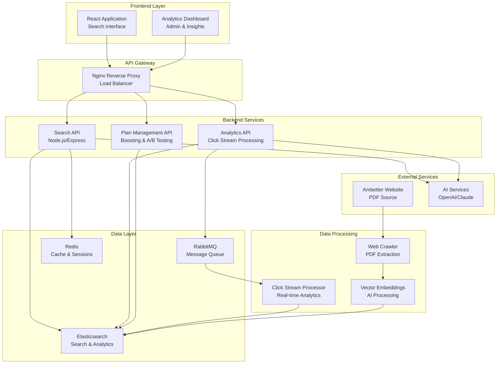
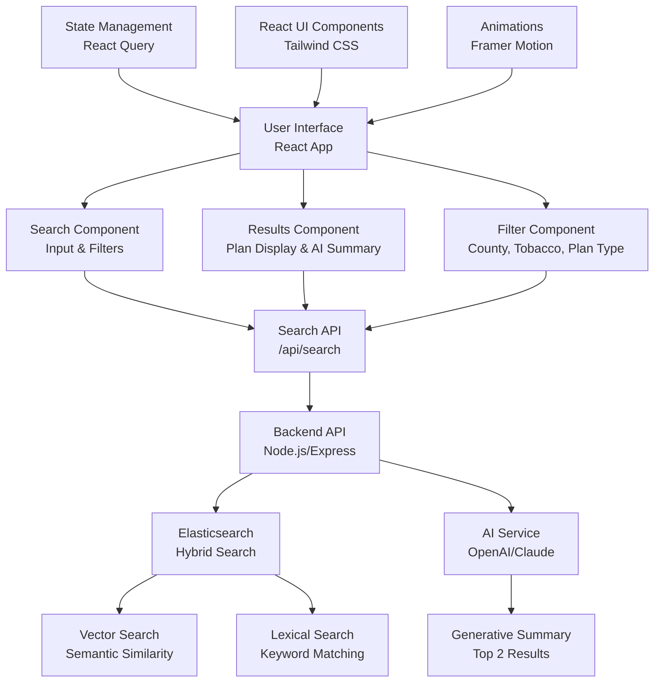
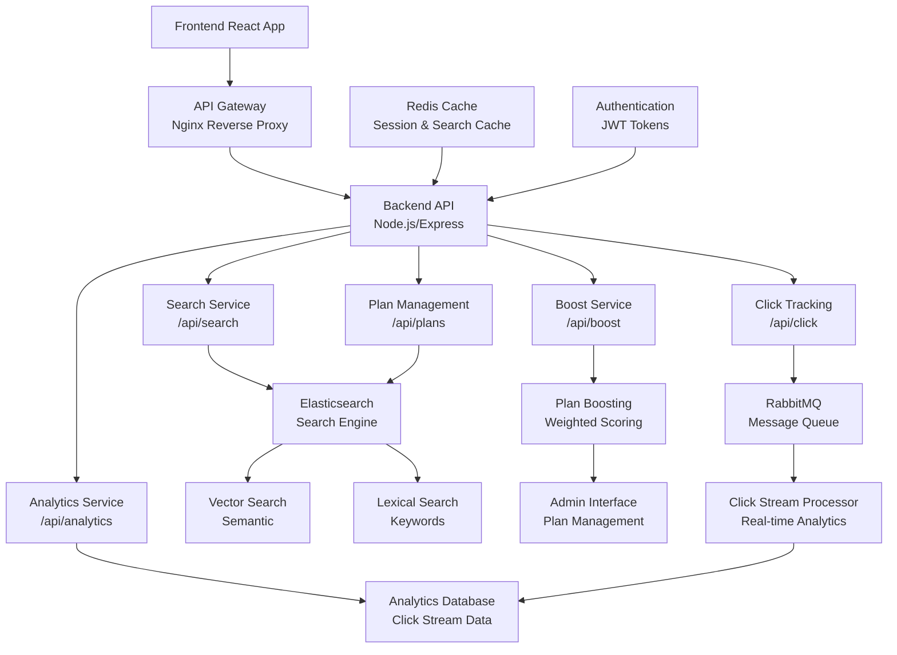

# Ambetter Health Plan Search Application - Project Requirements

## Project Overview
A comprehensive full-stack application for searching and analyzing Ambetter health plans in Texas, featuring advanced search capabilities, plan boosting, and analytics dashboard.

### System Overview Architecture

## System Components Overview

### Data Flow Architecture

## Part 1: Data Indexing & Elasticsearch Setup

### Architecture Diagram

### Elasticsearch Configuration
- **Elasticsearch cluster** with OpenSearch or Elasticsearch
- **Crawler configuration** to scrape PDFs from: `https://www.ambetterhealth.com/en/tx/2025-brochures-epo/`
- **Document processing pipeline** to extract and structure data from PDFs

### Document Schema & Attributes
Custom mapping for health plan documents with the following attributes:
- `state` (Texas)
- `tobacco_use` (boolean)
- `county` (if applicable)
- `plan_name`
- `plan_type` (EPO, HMO, etc.)
- `coverage_area`
- `premium_range`
- `deductible_info`
- `network_providers`
- `specialty_benefits`
- `eligibility_requirements`
- `document_url`
- `extracted_text`
- `metadata`

### Data Processing Requirements
- PDF text extraction and parsing
- Structured data extraction from health plan documents
- Metadata enrichment and categorization
- Vector embeddings generation for semantic search

## Part 2: React Frontend Application

### Architecture Diagram

### Core Features
- **Search Interface**:
  - Search input with autocomplete
  - Filter options (county, tobacco use, plan type)
  - Search results display
- **React Search Results Page**:
  - Generative AI summary of top 2 results
  - Context highlighting of search terms
  - Plan value propositions
  - Eligibility information
  - Related PDF documents list

### Search Capabilities
- **Vector Search**: Semantic similarity using Elasticsearch's dense vector search
- **Lexical Search**: Traditional text search with keyword matching
- **Hybrid Search**: Combining vector similarity with keyword matching
- **Faceted Search**: Filter by county, tobacco use, plan type
- **Auto-complete**: Suggest search terms as user types

### UI/UX Requirements
- Match Ambetter's design language from `https://www.ambetterhealth.com/en/tx/`
- Responsive design for mobile and desktop
- Modern, clean interface
- Intuitive search experience

## Part 3: Backend API & Plan Boosting

### Architecture Diagram

### Backend Architecture
- **Node.js + Express**
- **RESTful API** design
- **Authentication & Authorization**
- **Rate limiting and security**

### API Endpoints
- `GET /api/search` - Main search endpoint with hybrid search
- `GET /api/plans` - Plan management and retrieval
- `POST /api/boost` - Plan boosting functionality
- `GET /api/analytics` - Search analytics data
- `POST /api/click` - Click tracking endpoint

### Plan Boosting System
- **Admin Interface**: Manage plan boosting weights
- **Weighted Scoring Algorithm**: Dynamic plan ranking
- **A/B Testing**: Test different plan rankings
- **Performance Metrics**: Track plan click-through rates

### Click Tracking System
- Track search queries and user interactions
- Store plan clicks and user behavior
- Real-time analytics data collection

## Part 4: Analytics & Click Stream

### Architecture Diagram

### Message Queue System
- **RabbitMQ** message broker for click stream data
- **Real-time event collection**
- **Data processing and enrichment**
- **Elasticsearch indexing** of analytics data

### React Analytics Dashboard Features
- **Search Volume Metrics**: Real-time search counts
- **Top Searched Terms**: Most popular search queries
- **Most Clicked Plans**: Plan performance rankings
- **User Behavior Patterns**: Search to click conversion
- **Geographic Distribution**: County-level search insights
- **Plan Performance Comparisons**: A/B test results
- **Conversion Rates**: Search to click analytics
- **Historical Trends**: Search patterns over time

### Click Stream Data Structure
- `search_query`
- `timestamp`
- `user_session_id`
- `clicked_plan_id`
- `search_filters` (county, tobacco_use, etc.)
- `result_position`
- `time_to_click`
- `user_agent`
- `ip_address` (anonymized)

## Technical Stack

### Backend Technologies
- **Elasticsearch/OpenSearch**: Search engine and analytics storage
- **Node.js + Express**: API framework
- **RabbitMQ**: Message queuing for click stream
- **Redis**: Caching and session management
- **Docker**: Containerization
- **Nginx**: Reverse proxy

### Frontend Technologies
- **React 18** with TypeScript
- **Tailwind CSS**: Styling framework
- **Axios**: HTTP client
- **React Query**: Data fetching and caching
- **Framer Motion**: Animations
- **Chart.js** or **D3.js**: Analytics visualizations

### AI/ML Components
- **OpenAI API** or **Anthropic Claude**: Generative summaries
- **Elasticsearch Vector Search**: Semantic search
- **Custom Embedding Models**: Health plan document embeddings
- **Text Processing**: PDF extraction and parsing

### Infrastructure
- **Docker Compose**: Local development environment
- **PM2**: Process management
- **Git**: Version control
- **CI/CD Pipeline**: Automated deployment

## Development Phases

### Phase 1: Data Foundation (Weeks 1-2)
1. Set up Elasticsearch cluster
2. Configure PDF crawler for Ambetter website
3. Implement document processing pipeline
4. Create custom mapping and indexing
5. Test data extraction and indexing

### Phase 2: React Frontend Development (Weeks 3-4)
1. Set up React 18 application with TypeScript
2. Implement search interface matching Ambetter design
3. Build React search results page with AI summaries
4. Integrate with Node.js backend API
5. Add filtering and faceted search

### Phase 3: Backend API (Weeks 5-6)
1. Build Node.js + Express RESTful API with search endpoints
2. Implement plan boosting system
3. Add click tracking functionality
4. Set up authentication and security
5. Integrate with React frontend

### Phase 4: Analytics & Dashboard (Weeks 7-8)
1. Set up RabbitMQ for click stream
2. Implement analytics data pipeline
3. Build React analytics dashboard
4. Add real-time metrics and visualizations
5. Implement A/B testing framework

## Key Features Summary

### Search Capabilities
- ✅ Hybrid search (vector + lexical)
- ✅ Faceted search with filters
- ✅ Auto-complete suggestions
- ✅ Generative AI summaries
- ✅ Context highlighting

### Plan Management
- ✅ Dynamic plan boosting
- ✅ A/B testing framework
- ✅ Performance metrics tracking
- ✅ Admin interface for management

### Analytics & Insights
- ✅ Real-time click stream analytics
- ✅ Search volume metrics
- ✅ Geographic distribution insights
- ✅ User behavior analysis
- ✅ Plan performance comparisons
- ✅ Conversion rate tracking

## Success Metrics
- Search response time < 200ms
- 95%+ search accuracy
- Real-time React analytics dashboard
- Mobile-responsive design
- Scalable architecture for future growth

## Future Enhancements
- Machine learning for personalized recommendations
- Advanced analytics with predictive insights
- Multi-state expansion beyond Texas
- Integration with external health plan APIs
- Advanced reporting and export capabilities
