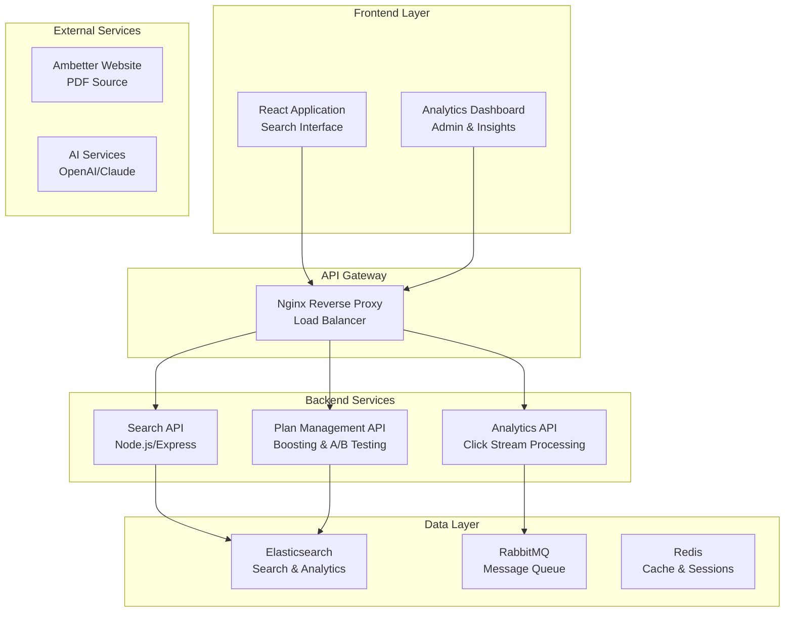

# Ambetter Health Plan Search Application

A comprehensive full-stack application for searching and analyzing Ambetter health plans in Texas, featuring advanced search capabilities, plan boosting, and analytics dashboard.

## 🏥 Project Overview

This application provides a powerful search interface for Texas Ambetter health plans, enabling users to find the most suitable health insurance plans based on their specific needs. The system features hybrid search capabilities, AI-powered summaries, and comprehensive analytics.

### Key Features

- 🔍 **Hybrid Search**: Combines vector similarity with keyword matching
- 🤖 **AI-Powered Summaries**: Generative summaries of top search results
- 📊 **Analytics Dashboard**: Real-time insights and click stream analytics
- ⚡ **Plan Boosting**: Dynamic plan ranking and A/B testing
- 📱 **Responsive Design**: Mobile-first approach matching Ambetter's design
- 🎯 **Smart Filtering**: Filter by county, tobacco use, plan type, and more

## 🏗️ System Architecture

### High-Level Architecture


## 📋 Project Requirements

Detailed project requirements and architecture diagrams are available in [PROJECT_REQUIREMENTS.md](./PROJECT_REQUIREMENTS.md).

## 🚀 Quick Start

### Prerequisites

- Node.js 18+ 
- Docker & Docker Compose
- Elasticsearch 8.x or OpenSearch 2.x
- Redis 6+
- RabbitMQ 3.8+

### Installation

1. **Clone the repository**
   ```bash
   git clone https://github.com/yourusername/ambetter-project.git
   cd ambetter-project
   ```

2. **Set up environment variables**
   ```bash
   cp .env.example .env
   # Edit .env with your configuration
   ```

3. **Start services with Docker Compose**
   ```bash
   docker-compose up -d
   ```

4. **Install dependencies**
   ```bash
   # Backend
   cd backend && npm install
   
   # Frontend
   cd frontend && npm install
   ```

5. **Run the application**
   ```bash
   # Start backend
   cd backend && npm run dev
   
   # Start frontend (in new terminal)
   cd frontend && npm start
   ```

## 🛠️ Technology Stack

### Frontend
- **React 18** with TypeScript
- **Tailwind CSS** for styling
- **React Query** for data fetching
- **Framer Motion** for animations
- **Chart.js** for analytics visualizations

### Backend
- **Node.js** with Express
- **Elasticsearch/OpenSearch** for search
- **RabbitMQ** for message queuing
- **Redis** for caching
- **JWT** for authentication

### AI/ML
- **OpenAI API** or **Anthropic Claude** for summaries
- **Elasticsearch Vector Search** for semantic search
- **Custom embeddings** for health plan documents

### Infrastructure
- **Docker** for containerization
- **Nginx** for reverse proxy
- **PM2** for process management

## 📁 Project Structure

```
ambetter-project/
├── docs/                          # Documentation
│   ├── PROJECT_REQUIREMENTS.md    # Detailed requirements
│   └── API_DOCUMENTATION.md       # API documentation
├── frontend/                      # React application
│   ├── src/
│   │   ├── components/            # React components
│   │   ├── pages/                 # Page components
│   │   ├── services/              # API services
│   │   └── utils/                 # Utility functions
│   └── public/                    # Static assets
├── backend/                       # Node.js API
│   ├── src/
│   │   ├── controllers/           # API controllers
│   │   ├── services/              # Business logic
│   │   ├── models/                # Data models
│   │   └── middleware/            # Express middleware
│   └── config/                    # Configuration files
├── crawler/                       # PDF crawling service
│   ├── src/
│   │   ├── crawlers/              # Web crawlers
│   │   ├── processors/            # Data processors
│   │   └── indexers/              # Elasticsearch indexers
├── analytics/                     # Analytics service
│   ├── src/
│   │   ├── processors/            # Click stream processors
│   │   ├── dashboards/            # Analytics dashboards
│   │   └── exporters/             # Data exporters
├── docker-compose.yml             # Docker services
├── .env.example                   # Environment variables template
└── README.md                      # This file
```

## 🔧 Development Phases

### Phase 1: Data Foundation (Weeks 1-2)
- [ ] Set up Elasticsearch cluster
- [ ] Configure PDF crawler for Ambetter website
- [ ] Implement document processing pipeline
- [ ] Create custom mapping and indexing
- [ ] Test data extraction and indexing

### Phase 2: Frontend Development (Weeks 3-4)
- [ ] Set up React application with TypeScript
- [ ] Implement search interface matching Ambetter design
- [ ] Build search results page with AI summaries
- [ ] Integrate with Elasticsearch search API
- [ ] Add filtering and faceted search

### Phase 3: Backend API (Weeks 5-6)
- [ ] Build RESTful API with search endpoints
- [ ] Implement plan boosting system
- [ ] Add click tracking functionality
- [ ] Set up authentication and security
- [ ] Integrate with frontend

### Phase 4: Analytics & Dashboard (Weeks 7-8)
- [ ] Set up RabbitMQ for click stream
- [ ] Implement analytics data pipeline
- [ ] Build analytics dashboard
- [ ] Add real-time metrics and visualizations
- [ ] Implement A/B testing framework

## 📊 API Endpoints

### Search API
- `GET /api/search` - Main search endpoint with hybrid search
- `GET /api/plans` - Plan management and retrieval
- `POST /api/boost` - Plan boosting functionality

### Analytics API
- `GET /api/analytics` - Search analytics data
- `POST /api/click` - Click tracking endpoint
- `GET /api/metrics` - Performance metrics

## 🧪 Testing

```bash
# Run backend tests
cd backend && npm test

# Run frontend tests
cd frontend && npm test

# Run integration tests
npm run test:integration
```

## 📈 Performance Metrics

- Search response time < 200ms
- 95%+ search accuracy
- Real-time analytics dashboard
- Mobile-responsive design
- Scalable architecture for future growth

## 🤝 Contributing

1. Fork the repository
2. Create a feature branch (`git checkout -b feature/amazing-feature`)
3. Commit your changes (`git commit -m 'Add some amazing feature'`)
4. Push to the branch (`git push origin feature/amazing-feature`)
5. Open a Pull Request

## 📄 License

This project is licensed under the MIT License - see the [LICENSE](LICENSE) file for details.

## 📞 Support

For support and questions, please open an issue in the GitHub repository or contact the development team.

## 🔮 Future Enhancements

- Machine learning for personalized recommendations
- Advanced analytics with predictive insights
- Multi-state expansion beyond Texas
- Integration with external health plan APIs
- Advanced reporting and export capabilities

---

**Built with ❤️ for better healthcare access in Texas**
