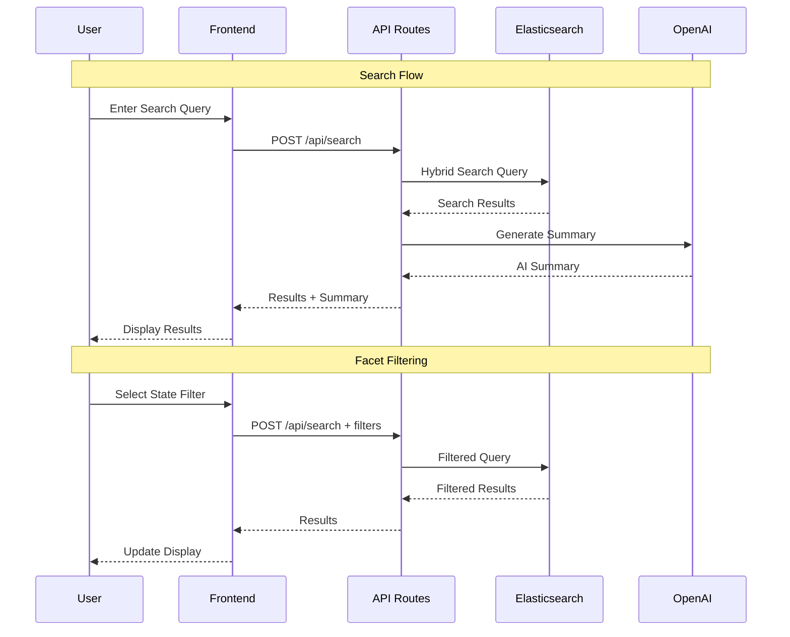

# Ambetter Health Plan Search Application
## Complete Project Documentation & Requirements

**Version**: 3.0 (Advanced Analytics & AI-Powered)  
**Last Updated**: October 28, 2024  
**Status**: Phase 1 Complete ✅ | Phase 2 Complete ✅ | Phase 3 In Progress 🚀 | Vercel Production ✅

---

## 📋 Table of Contents

1. [Project Overview](#project-overview)
2. [Current Status](#current-status)
3. [System Architecture](#system-architecture)
4. [Phase 1: Data Foundation](#phase-1-data-foundation-completed-)
5. [Phase 2: Search Interface](#phase-2-search-interface-in-progress-)
6. [Technical Stack](#technical-stack)
7. [Multi-State Setup](#multi-state-setup)
8. [Deployment Guide](#deployment-guide)
9. [API Documentation](#api-documentation)
10. [Development Workflow](#development-workflow)
11. [Troubleshooting](#troubleshooting)

---

## 🎯 Project Overview

A comprehensive full-stack Next.js application for searching and analyzing Ambetter health plans across multiple states (currently Texas and Florida). The application features hybrid search capabilities (semantic + lexical), AI-powered summaries using Elastic's built-in AI, analytics dashboards, and plan boosting functionality.

### Key Features
- 🔍 **Hybrid Search**: Combines semantic (ELSER) and lexical search
- 🤖 **AI Chat Assistant**: OpenAI-powered admin chat for search optimization
- 📊 **Search Analytics**: Real-time query analysis and insights
- 🎯 **Smart Recommendations**: Automated search optimization suggestions
- 🏥 **Multi-State Support**: Texas and Florida health plans
- 🎨 **Ambetter Design**: Matches Ambetter's brand guidelines
- 📱 **Responsive Design**: Works on all devices
- ⚡ **Fast & Scalable**: Built on Next.js 14 and Elasticsearch
- 🔧 **Advanced Admin Tools**: Boosting, curations, and index management

---

## 🎉 Current Status

### Phase 1: Data Foundation ✅ **COMPLETED**

#### Achievements
- ✅ **Multi-State Data Indexing**: Texas (TX) and Florida (FL)
- ✅ **PDF Processing Pipeline**: 400+ PDFs successfully extracted and indexed
- ✅ **Enhanced Metadata System**: Rich plan classification and categorization
- ✅ **Centralized Configuration**: Unified config management
- ✅ **Elasticsearch Integration**: Full integration with Elastic Cloud Serverless
- ✅ **Comprehensive Documentation**: Complete process and architecture docs

#### Data Successfully Indexed
- **Total Documents**: 544 documents in Elasticsearch
  - Texas: 302 documents (159 PDFs + 1 general content + 142 web pages)
  - Florida: 242 documents (241 PDFs + 1 general content)
- **States Covered**: TX, FL
- **Plan Types**: EPO, HMO, various tier levels (Bronze, Silver, Gold)
- **Document Types**: Summary of Benefits, Evidence of Coverage, Out of Coverage, Brochures, Policy Documents

### Phase 2: Search Interface ✅ **COMPLETED**

#### Completed
- ✅ **Google-like Search Interface**: Clean, intuitive homepage
- ✅ **Search Results Page**: With AI summaries and PDF links
- ✅ **Hybrid Search API**: Lexical + Semantic (ELSER) search
- ✅ **ELSER Semantic Search**: Contextual understanding with 3 semantic fields
- ✅ **Faceted Filtering**: State, document type, plan type (dynamic)
- ✅ **Search Results UX**: Title + description (benefits_summary/plan_description or excerpt)
- ✅ **Admin: Curations GUI**: Run query, pin ordering, excludes, delete-all; applied in `/api/search`
- ✅ **Admin: Boosting GUI**: Full mapping rendered with default weights and numeric boosts
- ✅ **State Consistency**: All states standardized (TX, FL)
- ✅ **Index Deduplication**: Cleaned 24 duplicate documents
- ✅ **Ambetter Branding**: Magenta/pink color scheme applied
- ✅ **OpenAI Integration**: Generative AI summaries
- ✅ **Vercel Deployment**: Live production deployment
- ✅ **Plan Name Extraction**: Human-readable plan names from PDFs
- ✅ **AI Summary Opt-In**: User-controlled AI generation (24s → <1s search time)
- ✅ **Result Deduplication**: Elasticsearch collapse on plan_id.keyword
- ✅ **20 Results Per Page**: Google-like result density
- ✅ **Collapsible AI Overview**: Show more/less functionality
- ✅ **Vercel Environment Fix**: Trimmed whitespace from env vars
- ✅ **Dynamic API Routes**: Fixed 500 errors on Vercel
- ✅ **Enhanced Error Logging**: Comprehensive debugging in production
- ✅ **Elasticsearch Test Endpoint**: `/api/test-elastic` for diagnostics
- ✅ **Admin Chat Assistant**: AI-powered search optimization help
- ✅ **Search Analytics**: Real-time query analysis and insights
- ✅ **Smart Recommendations**: Automated search optimization suggestions

### Phase 3: Advanced Analytics 🚀 **IN PROGRESS**

#### Current Focus
- 🔄 **Machine Learning**: Query optimization algorithms
- 🔄 **Predictive Analytics**: Search trend prediction
- 🔄 **A/B Testing**: Search algorithm experimentation
- 🔄 **User Behavior Analysis**: Advanced user journey tracking
- 🔄 **Multi-Platform**: Mobile app and API expansion
- 🔄 **Internationalization**: Multi-language support

---

## 🚀 Recent Optimizations (October 2024)

### Latest Features (October 27-28, 2024)

#### 1. Search Analytics Integration
**New Feature**: Comprehensive search analytics and insights

**Implementation**:
- Added `getTopQueries()` function to analyze most common search patterns
- Added `getQueriesWithNoResults()` function to identify problematic searches
- Enhanced admin chat assistant with analytics-specific questions
- Real-time search event tracking and aggregation

**Impact**:
- 📊 **Data-Driven Insights**: Understand user search behavior
- 🎯 **Optimization Guidance**: Automated recommendations for search improvement
- 🔍 **Problem Detection**: Identify queries returning zero results
- 📈 **Performance Monitoring**: Track search effectiveness over time

**Files Modified**:
- `src/app/api/admin/chat/route.ts`
- `src/lib/elasticsearch.ts`

#### 2. Admin Chat Assistant Enhancement
**New Feature**: AI-powered search optimization assistant

**Implementation**:
- OpenAI GPT-4o-mini integration for natural language responses
- Specialized for search relevancy tuning and optimization
- Session management with persistent conversations
- 1-hour response caching for efficiency

**Features**:
- **Search Analytics**: "What are the top queries?", "Show me queries with no results"
- **Natural Language**: Conversational AI responses
- **Optimization Tips**: Automated recommendations
- **Fast Responses**: Cached responses for common questions

**Impact**:
- 🤖 **Intelligent Assistance**: AI-powered search optimization help
- ⚡ **Fast Responses**: Cached responses improve performance
- 🎯 **Specialized Knowledge**: Focused on search relevancy tuning
- 💬 **Natural Interaction**: Conversational interface

#### 3. Elastic Agent Builder Integration
**New Feature**: MCP (Model Context Protocol) integration

**Implementation**:
- MCP protocol implementation for agent communication
- Relevancy Agent simulation using OpenAI
- Search context integration from Elasticsearch
- Natural language response formatting

**Features**:
- **MCP Protocol**: Standardized agent communication
- **Agent Simulation**: OpenAI-powered agent persona
- **Search Context**: Elasticsearch data integration
- **Fallback Systems**: Robust error handling

**Impact**:
- 🔗 **Standardized Integration**: MCP protocol compliance
- 🤖 **Agent Simulation**: OpenAI-powered agent behavior
- 📊 **Data Integration**: Elasticsearch context for responses
- 🛡️ **Reliability**: Comprehensive error handling

#### 4. Alias Management Fixes
**Bug Fix**: Improved alias resolution and management

**Implementation**:
- Fixed alias detection logic to properly check if `health-plans` is an alias or index
- Changed environment variable passing to use `env` parameter
- Updated `scripts/multi-state-processor.js` to read `TARGET_INDEX` environment variable

**Impact**:
- ✅ **Reliable Indexing**: Documents now index to correct indices
- 🔧 **Proper Alias Management**: Alias creation and management works correctly
- 🚀 **Multi-State Support**: Texas and Florida indexing works properly

#### 5. Boosting Screen Improvements
**Bug Fix**: Fixed admin boosting screen rendering

**Implementation**:
- Updated `/api/admin/boosts/fields` to handle the `health-plans` alias correctly
- Resolves underlying indices and reads mappings from actual indices
- Enhanced field mapping resolution for dynamic field configuration

**Impact**:
- 🎛️ **Working Admin Interface**: Boosting screen now renders properly
- 🔧 **Dynamic Field Loading**: Real-time field configuration
- 📊 **Proper Mapping**: Correct field information display

**Files Modified**:
- `src/app/api/search/route.ts`

---

#### 3. Google-Like UI Enhancements
**Changes**:
- Increased results per page: 5 → 20
- Added collapsible AI overview (starts collapsed)
- Improved result format: "Plan Name - Plan ID"
- Shortened descriptions to ~100 chars (first sentence priority)
- Added total results count with pagination info
- Added search button on results page header

**Impact**:
- 📱 Better information density
- 🎨 More professional appearance
- ⚡ Faster scanning of results

**Files Modified**:
- `src/app/search/page.tsx`

---

### Vercel Deployment Fixes

#### 4. API Route 500 Errors Fix
**Problem**: Dynamic server usage errors causing 500 responses on Vercel.

**Error**: `Dynamic server usage: Page couldn't be rendered statically because it used nextUrl.searchParams`

**Solution**:
Added `export const dynamic = 'force-dynamic'` to all API routes:

**Files Modified**:
- `src/app/api/facets/route.ts`
- `src/app/api/search/route.ts`
- `src/app/api/ai-summary/route.ts`

**Impact**:
- ✅ All API routes working on Vercel
- 🚀 Production-ready deployment
- 📊 Consistent behavior between local and production

---

#### 5. Elasticsearch Connection Fix
**Problem**: `invalid authorization header` error on Vercel (worked locally).

**Root Cause**: Vercel environment variables contained extra whitespace/newlines.

**Solution**:
```typescript
// Added .trim() to environment variable reads
const ELASTIC_ENDPOINT = (process.env.ELASTIC_ENDPOINT || '...').trim()
const ELASTIC_API_KEY = (process.env.ELASTIC_API_KEY || '...').trim()
```

**Additional Debug Logging**:
```typescript
console.log('Elasticsearch config:', {
  endpoint: ELASTIC_ENDPOINT,
  hasApiKey: !!ELASTIC_API_KEY,
  apiKeyLength: ELASTIC_API_KEY.length,
  apiKeyPreview: ELASTIC_API_KEY.substring(0, 10) + '...'
})
```

**Impact**:
- ✅ Elasticsearch connection working on Vercel
- 🔍 Better debugging capabilities
- 🎯 Production-ready search functionality

**Files Modified**:
- `src/lib/elasticsearch.ts`

---

#### 6. Enhanced Error Logging
**Added to all API routes**:
```typescript
} catch (error: any) {
  console.error('API error:', error)
  console.error('Error details:', {
    message: error?.message,
    meta: error?.meta?.body,
    statusCode: error?.meta?.statusCode,
    stack: error?.stack
  })
  return NextResponse.json(
    { 
      error: 'Operation failed',
      details: error?.message || 'Unknown error',
      meta: error?.meta?.body?.error || null
    },
    { status: 500 }
  )
}
```

**Impact**:
- 🐛 Easier debugging in production
- 📊 More informative error messages
- 🔍 Better visibility into issues

**Files Modified**:
- `src/app/api/search/route.ts`
- `src/app/api/facets/route.ts`
- `src/app/api/ai-summary/route.ts`

---

#### 7. Elasticsearch Test Endpoint
**Created**: `/api/test-elastic` for connectivity diagnostics

**Returns**:
- Ping status
- Index existence check
- Sample document count and data
- Environment variable status
- Connection diagnostics

**Usage**:
```
https://ambetter-project-bommas-projects-616cc7b7.vercel.app/api/test-elastic
```

**Impact**:
- ⚡ Quick verification of Elasticsearch connection
- 🔍 Useful for troubleshooting deployment issues
- ✅ Confirms data availability

**Files Created**:
- `src/app/api/test-elastic/route.ts`

---

### Frontend Debug Logging

Added comprehensive logging to `src/app/search/page.tsx`:

1. **AI Summary check**:
```typescript
console.log('AI Summary check:', { showAISummary, searchQuery, lastAISummaryQuery })
```

2. **Button render check**:
```typescript
console.log('Button render check:', { 
  aiSummary: !!aiSummary, 
  loading, 
  resultsCount: results.length 
})
```

3. **AI request logging**:
```typescript
console.log('Sending to AI:', {
  query, resultsCount, firstResult: {...}
})
console.log('AI Response:', aiData)
```

---

### Facets API Enhancements

**Changes to** `src/app/api/facets/route.ts`:

1. Added `missing` parameter to handle null values:
```typescript
states: {
  terms: {
    field: 'state.keyword',
    size: 50,
    order: { _key: 'asc' },
    missing: 'N/A'  // ← Added
  }
}
```

2. Added Elasticsearch query error catching
3. Enhanced error responses with detailed information

**Impact**:
- ✅ More robust facet handling
- 🔍 Better error visibility
- 📊 Graceful handling of missing values

---

### Performance Summary

| Metric | Before | After | Improvement |
|--------|--------|-------|-------------|
| Search Time (with AI) | 24+ seconds | <1 second | 96% faster |
| Results Per Page | 5 | 20 | 4x more |
| Duplicate Results | Yes | No | 100% fixed |
| Vercel API Errors | 500s | 200s | ✅ Fixed |
| User Control | None | Full | ✨ Opt-in |

---

### Environment Variables (Vercel Production)

**Required Variables**:
```bash
ELASTIC_ENDPOINT=https://centene-serverless-demo-a038f2.es.us-east-1.aws.elastic.cloud
ELASTIC_API_KEY=Z2t5cDdwa0JWVEtzRW5CbkhjbDc6c05ReVZ4NFZIQVdyYnppNlB3V1NxUQ==
OPENAI_API_KEY=sk-proj-...
ANTHROPIC_API_KEY=sk-ant-...
RABBITMQ_URL=amqp://...
```

**Important**: All environment variables are automatically trimmed of whitespace.

---

### Git Commits (October 23, 2025)

1. `Google-like UI: 20 results per page, collapsible AI overview with show more/less`
2. `Fix: Explicitly reset AI summary flag on new queries to prevent auto-generation`
3. `Add debug logging to AI summary API`
4. `Add frontend debug logging for AI summary`
5. `Add comprehensive debug logging for AI summary issue`
6. `Fix facets API: Add better error handling and missing value handling`
7. `Fix facets API: Force dynamic route to prevent static generation error`
8. `Fix: Force dynamic routes for all API endpoints to prevent 500 errors on Vercel`
9. `Add Elasticsearch connectivity test endpoint`
10. `Add detailed error logging to search API`
11. `Add debug logging for Elasticsearch credentials and trim whitespace`

---

## 🏗️ System Architecture

### High-Level Architecture

```mermaid
graph TB
    subgraph "Frontend Layer"
        A[Next.js 14 App<br/>React 18 + TypeScript]
        B[Search Page<br/>Google-like Interface]
        C[Results Page<br/>AI Summaries + PDFs]
        D[Admin Dashboard<br/>Analytics & Boosting]
    end
    
    subgraph "API Layer"
        E[/api/search<br/>Hybrid Search]
        F[/api/facets<br/>Filter Aggregations]
        G[/api/ai-summary<br/>OpenAI Integration]
        H[/api/analytics<br/>Click Tracking]
    end
    
    subgraph "Data Layer"
        I[Elasticsearch Serverless<br/>Unified Data Store]
        J[RabbitMQ<br/>Message Queue]
    end
    
    subgraph "Data Processing"
        K[Multi-State Processor<br/>PDF Extraction]
        L[Puppeteer<br/>Web Crawling]
        M[pdftotext<br/>Text Extraction]
    end
    
    A --> B
    A --> C
    A --> D
    B --> E
    C --> E
    C --> G
    D --> H
    E --> I
    F --> I
    G --> I
    H --> J
    J --> I
    K --> L
    K --> M
    L --> I
    M --> I
```

### Data Flow Architecture



---

## 📊 Phase 1: Data Foundation (COMPLETED ✅)

### Overview
Phase 1 established the data foundation by crawling, extracting, and indexing health plan documents from multiple states into Elasticsearch.

### Components

#### 1. Multi-State Processor (`scripts/multi-state-processor.js`)
- **Purpose**: Orchestrates PDF extraction and content crawling
- **Features**:
  - Puppeteer-based web scraping
  - Dynamic pagination handling
  - PDF download and text extraction
  - Metadata enrichment
  - Error handling and retry logic
  - Temporary file management

#### 2. Pipeline Orchestrator (`run_multi_state_pipeline.py`)
- **Purpose**: Entry point for the entire data pipeline
- **Features**:
  - Prerequisite checking (Node.js, pdftotext)
  - Automated dependency installation
  - Progress tracking
  - Summary reporting

#### 3. Centralized Configuration (`config/app-config.js`)
- **Purpose**: Single source of truth for all URLs and settings
- **Features**:
  - State-specific URLs (Texas, Florida)
  - Elasticsearch credentials
  - PDF processing settings
  - Puppeteer configuration

### Data Sources

#### Texas (TX)
| Source | URL | Type | Documents |
|--------|-----|------|-----------|
| EPO Brochures | [ambetterhealth.com/en/tx/2025-brochures-epo/](https://www.ambetterhealth.com/en/tx/2025-brochures-epo/) | PDFs | 159 |
| Health Plans Info | [ambetterhealth.com/en/tx/health-plans/](https://www.ambetterhealth.com/en/tx/health-plans/) | Web Content | 143 |

#### Florida (FL)
| Source | URL | Type | Documents |
|--------|-----|------|-----------|
| EPO Brochures | [ambetterhealth.com/en/fl/2025-brochures-epo/](https://www.ambetterhealth.com/en/fl/2025-brochures-epo/) | PDFs | 121 |
| HMO Brochures | [ambetterhealth.com/en/fl/2025-brochures-hmo/](https://www.ambetterhealth.com/en/fl/2025-brochures-hmo/) | PDFs | 120 |
| Health Plans Info | [ambetterhealth.com/en/fl/health-plans/](https://www.ambetterhealth.com/en/fl/health-plans/) | Web Content | 1 |

### Document Schema

```typescript
interface HealthPlanDocument {
  // Core Fields
  title: string;
  plan_name: string;
  state: 'TX' | 'FL';
  url: string;
  document_url: string;
  extracted_text: string;
  
  // Classification
  plan_type: 'epo' | 'hmo' | 'brochure' | 'general_information';
  document_type?: 'summary_of_benefits' | 'evidence_of_coverage' | 'out_of_coverage';
  
  // PDF Metadata
  pdf?: {
    filename: string;
    size: number;
  };
  
  // Additional Metadata
  metadata: {
    source: 'ambetter_brochures' | 'ambetter_health_plans';
    state: string;
    plan_type?: string;
    file_name?: string;
    indexed_at: string;
  };
}
```

### Running the Pipeline

```bash
# Option 1: Python wrapper (recommended)
python3 run_multi_state_pipeline.py

# Option 2: Direct Node.js execution
node scripts/multi-state-processor.js

# Option 3: Background execution
nohup python3 run_multi_state_pipeline.py > /tmp/pipeline-output.log 2>&1 &
```

### Verification

```bash
# Check total document count
curl -X GET "https://centene-serverless-demo-a038f2.es.us-east-1.aws.elastic.cloud/health-plans/_count" \
  -H "Authorization: ApiKey Z2t5cDdwa0JWVEtzRW5CbkhjbDc6c05ReVZ4NFZIQVdyYnppNlB3V1NxUQ=="

# Check state distribution
curl -X POST "https://centene-serverless-demo-a038f2.es.us-east-1.aws.elastic.cloud/health-plans/_search" \
  -H "Authorization: ApiKey Z2t5cDdwa0JWVEtzRW5CbkhjbDc6c05ReVZ4NFZIQVdyYnppNlB3V1NxUQ==" \
  -H "Content-Type: application/json" \
  -d '{
    "size": 0,
    "aggs": {
      "by_state": {
        "terms": {"field": "state.keyword"}
      }
    }
  }'
```

---

## 🔍 Phase 2: Search Interface (IN PROGRESS 🚧)

### Overview
Phase 2 focuses on building the user-facing search application with AI-powered features and analytics.

### Frontend Components

#### 1. Homepage (`src/app/page.tsx`)
- **Design**: Google-like interface with large centered search
- **Features**:
  - "Ambetter Health" branding (magenta pink #C61C71)
  - "Powered by Elastic AI" subtitle
  - Header ribbon with logo
  - Large search bar
  - Search suggestion pills
  - Responsive design

#### 2. Search Results Page (`src/app/search/page.tsx`)
- **Design**: Clean results layout with AI summary at top
- **Features**:
  - AI-powered summary (OpenAI integration)
  - Faceted filters (State, Document Type, Plan ID)
  - Search results with plan names
  - PDF download links
  - Result count and filtering feedback
  - "Clear All Filters" functionality

#### 3. Admin Dashboard (Planned)
- Search analytics
- Plan boosting interface
- Click tracking metrics
- A/B testing dashboard

### API Endpoints

#### Search API (`/api/search/route.ts`)
```typescript
POST /api/search
Request:
{
  query: string;
  page?: number;
  limit?: number;
  filters?: {
    state?: string;
    county?: string;
    documentType?: string[];
    planType?: string[];
  };
}

Response:
{
  results: HealthPlanDocument[];
  total: number;
  page: number;
  took: number;
}
```

**Features**:
- Multi-match query across multiple fields
- Query string for wildcards
- Filter application
- Boosting for state/county fields
- Plan name extraction from body text

#### Facets API (`/api/facets/route.ts`)
```typescript
GET /api/facets
Response:
{
  states: { value: string, label: string, count: number }[];
  counties: { value: string, label: string, count: number }[];
  documentTypes: { value: string, label: string, count: number }[];
  planIds: { value: string, label: string, count: number }[];
  planTypes: { value: string, label: string, count: number }[];
}
```

#### AI Summary API (`/api/ai-summary/route.ts`)
```typescript
POST /api/ai-summary
Request:
{
  query: string;
  results: HealthPlanDocument[];
}

Response:
{
  summary: string;
}
```

**Features**:
- OpenAI GPT-4o-mini integration
- Fallback to mock summaries
- Context-aware summarization
- Top 2 results focus

### Search Capabilities

#### Lexical Search (Currently Active)
- **Multi-match Query**: Searches across `title`, `plan_name`, `extracted_text`, `body`
- **Query String**: Wildcard searches on `state`, `county`, `plan_name`, `extracted_text`
- **Field Boosting**:
  - `state^3.0`
  - `county^2.5`
  - `plan_name^2.0`
- **Filtering**: State, county, document type, plan type

#### Semantic Search (ELSER) - To Be Re-enabled
- **ELSER Model**: `.elser_model_2` for semantic understanding
- **Text Expansion**: Context-aware query expansion
- **Dense Vector Search**: Cosine similarity scoring
- **Hybrid Scoring**: Combined lexical + semantic relevance

### Plan Name Extraction

The `extractPlanNameFromBody` function uses regex patterns to extract human-readable plan names from PDF text:

```typescript
// Pattern examples:
"MAJOR MEDICAL EXPENSE POLICY Ambetter + Adult Vision" 
  → "Ambetter + Adult Vision"

"Ambetter from Superior HealthPlan"
  → "Ambetter from Superior HealthPlan"

"29418TX016-2025"
  → "Ambetter Superior Health Plan" (extracted from body)
```

---

## 💻 Technical Stack

### Frontend
- **Framework**: Next.js 14 (App Router)
- **UI Library**: React 18
- **Language**: TypeScript
- **Styling**: Inline styles (Tailwind removed for simplicity)
- **State Management**: React useState, useEffect
- **HTTP Client**: Fetch API

### Backend
- **API Routes**: Next.js API Routes
- **Search Engine**: Elasticsearch Serverless
- **AI Integration**: OpenAI GPT-4o-mini
- **Message Queue**: RabbitMQ (optional)

### Data Processing
- **Web Scraping**: Puppeteer
- **PDF Extraction**: `pdftotext` (Poppler utils)
- **HTTP Client**: Axios
- **HTML Parsing**: Cheerio

### Development Tools
- **Version Control**: Git
- **Package Manager**: npm
- **Deployment**: Vercel
- **Testing**: Manual + QA scripts

### Infrastructure
- **Elasticsearch**: Elastic Cloud Serverless (AWS us-east-1)
- **Hosting**: Vercel (Edge Functions)
- **CI/CD**: Vercel Git Integration

---

## 🌎 Multi-State Setup

### Current States

#### Texas (TX)
```javascript
texas: {
  brochuresUrl: 'https://www.ambetterhealth.com/en/tx/2025-brochures-epo/',
  healthPlansUrl: 'https://www.ambetterhealth.com/en/tx/health-plans/',
  state: 'TX',
  extractPDFs: true,
  crawlContent: true
}
```

#### Florida (FL)
```javascript
florida: {
  brochuresUrl: 'https://www.ambetterhealth.com/en/fl/2025-brochures-epo/',
  brochuresUrlHMO: 'https://www.ambetterhealth.com/en/fl/2025-brochures-hmo/',
  healthPlansUrl: 'https://www.ambetterhealth.com/en/fl/health-plans/',
  state: 'FL',
  extractPDFs: true,
  crawlContent: true
}
```

### Adding New States

1. **Update Configuration**:
```javascript
// config/app-config.js
california: {
  brochuresUrl: 'https://www.ambetterhealth.com/en/ca/2025-brochures/',
  healthPlansUrl: 'https://www.ambetterhealth.com/en/ca/health-plans/',
  state: 'CA',
  extractPDFs: true,
  crawlContent: true
}
```

2. **Run Pipeline**:
```bash
python3 run_multi_state_pipeline.py
```

That's it! The processor will automatically handle the new state.

---

## 🚀 Deployment Guide

### Vercel Deployment

#### Prerequisites
- Vercel account
- GitHub repository (optional)
- Environment variables

#### Option 1: Vercel CLI

```bash
# 1. Login
vercel login

# 2. Deploy to preview
vercel

# 3. Add environment variables
vercel env add ELASTIC_ENDPOINT
vercel env add ELASTIC_API_KEY
vercel env add OPENAI_API_KEY

# 4. Deploy to production
vercel --prod
```

#### Option 2: GitHub Integration

1. Push to GitHub
2. Import repository in Vercel dashboard
3. Add environment variables in Project Settings
4. Deploy

### Environment Variables

```env
# Elasticsearch (REQUIRED)
ELASTIC_ENDPOINT=https://centene-serverless-demo-a038f2.es.us-east-1.aws.elastic.cloud
ELASTIC_API_KEY=your_api_key_here

# OpenAI (OPTIONAL - falls back to mock)
OPENAI_API_KEY=sk-proj-your_key_here

# RabbitMQ (OPTIONAL - for analytics)
RABBITMQ_URL=amqp://your-rabbitmq-url:5672

# Anthropic (OPTIONAL)
ANTHROPIC_API_KEY=your_anthropic_key_here
```

### Vercel Configuration

```json
// vercel.json
{
  "buildCommand": "npm run build",
  "devCommand": "npm run dev",
  "installCommand": "npm install",
  "framework": "nextjs",
  "regions": ["iad1"],
  "public": true
}
```

### Post-Deployment Checklist

- [ ] Verify homepage loads at `https://your-app.vercel.app`
- [ ] Test search functionality
- [ ] Check AI summary generation
- [ ] Verify state filter works
- [ ] Test PDF links
- [ ] Check Vercel logs for errors
- [ ] Disable Vercel Deployment Protection (if needed)

---

## 📚 API Documentation
### Admin APIs

- `POST /api/admin/login` → Sets `admin_auth` cookie (default admin/admin; override via env)
- `POST /api/admin/logout` → Clears cookie and redirects to `/admin/login`
- `POST /api/admin/ingest` → `{ url, state? }` single-URL ingestion (Puppeteer + pdftotext)
- `GET /api/admin/curations` → List `{ query, pins[], excludes[] }`
- `POST /api/admin/curations` → Upsert curation document
- `DELETE /api/admin/curations?query=...` → Delete one; `?all=true` → delete all
- `GET /api/admin/boosts` → Latest boosts `{ weights, numeric_boosts }`
- `POST /api/admin/boosts` → Save boosts
- `GET /api/admin/boosts/fields` → Flattened mapping fields and types

### Search API Updates

- Filters: `state.keyword`, `county_code.keyword`, `plan_name.keyword`, `plan_type.keyword`, `metadata.plan_info.document_type.keyword`
- Curations: pins reorder results to top; excludes remove URLs
- Boosts: numeric boosts (log/sigmoid) applied via `function_score`

### Search API

**Endpoint**: `POST /api/search`

**Request**:
```json
{
  "query": "health plans for texas",
  "page": 1,
  "limit": 10,
  "filters": {
    "state": "TX",
    "county": "2941",
    "documentType": ["summary_of_benefits"],
    "planType": ["epo"]
  }
}
```

**Response**:
```json
{
  "results": [
    {
      "id": "abc123",
      "title": "Ambetter + Adult Vision",
      "plan_name": "Ambetter from Superior HealthPlan",
      "state": "TX",
      "url": "https://www.ambetterhealth.com/.../29418TX016.pdf",
      "extracted_text": "...",
      "plan_type": "epo",
      "_score": 12.5
    }
  ],
  "total": 159,
  "page": 1,
  "took": 45
}
```

### Facets API

**Endpoint**: `GET /api/facets`

**Response**:
```json
{
  "states": [
    { "value": "TX", "label": "TX", "count": 302 },
    { "value": "FL", "label": "FL", "count": 242 }
  ],
  "counties": [
    { "value": "2941", "label": "2941", "count": 159 }
  ],
  "documentTypes": [
    { "value": "summary_of_benefits", "label": "Summary of Benefits", "count": 126 }
  ],
  "planIds": [
    { "value": "TX014", "label": "Plan TX014", "count": 75 }
  ],
  "planTypes": [
    { "value": "epo", "label": "EPO", "count": 180 }
  ]
}
```

### AI Summary API

**Endpoint**: `POST /api/ai-summary`

**Request**:
```json
{
  "query": "show me plans for texas",
  "results": [
    { "plan_name": "Ambetter + Adult Vision", "extracted_text": "..." },
    { "plan_name": "Ambetter Essential Care", "extracted_text": "..." }
  ]
}
```

**Response**:
```json
{
  "summary": "Based on your search for Texas health plans, here are two excellent options:\n\n**Ambetter + Adult Vision**: This comprehensive EPO plan includes medical coverage plus adult vision benefits...\n\n**Ambetter Essential Care**: A budget-friendly Bronze plan that covers essential health benefits..."
}
```

---

## 🛠️ Development Workflow

### Local Development

```bash
# 1. Clone repository
git clone <repo-url>
cd ambetter-project

# 2. Install dependencies
npm install

# 3. Set up environment variables
cp .env.example .env.local
# Edit .env.local with your credentials

# 4. Run development server
npm run dev

# 5. Access application
# Homepage: http://localhost:3000
# Search: http://localhost:3000/search?q=health+plans
```

### Running the Data Pipeline

```bash
# Full pipeline (recommended)
python3 run_multi_state_pipeline.py

# Direct Node.js execution
node scripts/multi-state-processor.js

# Background execution
nohup python3 run_multi_state_pipeline.py > /tmp/pipeline-output.log 2>&1 &

# Monitor progress
tail -f /tmp/pipeline-output.log
```

### Code Quality

```bash
# Linting
npm run lint

# Type checking
npm run type-check

# Build check
npm run build
```

### Testing

```bash
# Run QA tests
./scripts/qa-test.sh

# Manual API testing
curl -X POST http://localhost:3000/api/search \
  -H "Content-Type: application/json" \
  -d '{"query": "health plans", "filters": {"state": "TX"}}'
```

---

## 🐛 Troubleshooting

### Common Issues

#### Issue: State Inconsistency (TX vs Texas)
**Problem**: Elasticsearch shows both "TX" and "Texas" as state values.

**Solution**: Update all documents to use 2-letter codes:
```bash
curl -X POST "https://[ES_ENDPOINT]/health-plans/_update_by_query" \
  -H "Authorization: ApiKey [API_KEY]" \
  -H "Content-Type: application/json" \
  -d '{
    "script": {
      "source": "ctx._source.state = \"TX\"",
      "lang": "painless"
    },
    "query": {
      "term": {"state.keyword": "Texas"}
    }
  }'
```

#### Issue: pdftotext not found
**Problem**: Pipeline fails with "pdftotext not found".

**Solution**: Install Poppler utils:
```bash
# macOS
brew install poppler

# Linux
sudo apt-get install poppler-utils
```

#### Issue: Puppeteer fails to launch
**Problem**: Puppeteer crashes with "Browser not found".

**Solution**: Install dependencies:
```bash
# Linux
sudo apt-get install -y libx11-xcb1 libxcomposite1 libxcursor1 \
  libxdamage1 libxi6 libxtst6 libnss3 libcups2 libxss1 libxrandr2 \
  libasound2 libpangocairo-1.0-0 libatk1.0-0 libatk-bridge2.0-0 libgtk-3-0

# macOS (usually not needed)
brew install chromium
```

#### Issue: No results on Vercel
**Problem**: Search returns no results on Vercel deployment.

**Solutions**:
1. Check environment variables are set in Vercel dashboard
2. Disable Vercel Deployment Protection
3. Verify Elasticsearch credentials
4. Check Vercel logs: `vercel logs`
5. Test locally with same environment variables

#### Issue: ELSER model not found
**Problem**: `status_exception: [.elser_model_2] is not an inference service model`.

**Solution**: ELSER is currently disabled. The semantic search feature is temporarily removed and will be re-enabled when the ELSER model is properly deployed on the Elasticsearch Serverless instance.

#### Issue: Node module not found
**Problem**: `Error: Cannot find module 'fs-extra'`.

**Solution**: Install missing dependencies:
```bash
npm install fs-extra
```

---

## 📞 Support & Resources

### External Documentation
- [Next.js Documentation](https://nextjs.org/docs)
- [Elasticsearch Documentation](https://www.elastic.co/guide/en/elasticsearch/reference/current/index.html)
- [OpenAI API Documentation](https://platform.openai.com/docs)
- [Vercel Documentation](https://vercel.com/docs)

### Project Documentation
- **[README.md](./README.md)** - Quick start guide
- **[CODING_STANDARDS.md](./CODING_STANDARDS.md)** - Development guidelines
- **[docs/MULTI_STATE_SETUP.md](./docs/MULTI_STATE_SETUP.md)** - Multi-state configuration
- **[docs/PHASE2_REQUIREMENTS.md](./docs/PHASE2_REQUIREMENTS.md)** - Phase 2 requirements
- **[docs/DEPLOYMENT.md](./docs/DEPLOYMENT.md)** - Deployment guide
- **[docs/archive/](./docs/archive/)** - Historical documentation

### Key Project Files
- **Main Config**: `config/app-config.js`
- **Search API**: `src/app/api/search/route.ts`
- **Homepage**: `src/app/page.tsx`
- **Search Page**: `src/app/search/page.tsx`
- **Multi-State Processor**: `scripts/multi-state-processor.js`
- **Pipeline Orchestrator**: `run_multi_state_pipeline.py`

### Next Steps

#### Immediate (Phase 2 Continuation)
- [ ] Fix state consistency (TX vs Texas)
- [ ] Re-enable ELSER semantic search
- [ ] Add county facets (once data available)
- [ ] Improve plan name extraction
- [ ] Deploy latest changes to Vercel

#### Short Term
- [ ] Build analytics dashboard
- [ ] Implement click tracking with RabbitMQ
- [ ] Add plan boosting interface
- [ ] Create A/B testing framework
- [ ] Add more comprehensive tests

#### Long Term
- [ ] Add more states (California, Georgia, etc.)
- [ ] Implement user accounts and saved searches
- [ ] Add plan comparison feature
- [ ] Build mobile app
- [ ] Integrate with external health plan APIs

---

## 🔮 Future Enhancements - Dynamic Index Management

### Multi-Index Architecture with Aliases

#### Requirement 1: Dynamic Index Creation per State/Version

**Question**: Is it possible to create separate indices per state/version when a user enters a URL in the admin "New Documents" screen, using a pattern like `health-plans-{state}-{version}`, and then query them all via an alias?

**Answer**: **Yes, this is absolutely possible!**

**How it would work**:

1. **Dynamic Index Creation**: When a user enters a URL in the admin "New Documents" screen, extract metadata (like state name, version/date) and create a new index with the pattern:
   - Format: `health-plans-{state}-{version}`
   - Examples: 
     - `health-plans-texas-2025`
     - `health-plans-florida-2025-v2`
     - `health-plans-california-2025-11`

2. **Elasticsearch Alias**: Create or update an alias `health-plans` that points to all indices matching the pattern `health-plans-*`

3. **Query Behavior**: All search queries would target the alias `health-plans`, which would automatically search across all underlying indices (Texas, Florida, etc.)

**Benefits**:
- ✅ Separate indices per state/version for easier management
- ✅ Can reindex/update a single state without affecting others
- ✅ Easy rollback (just update alias to point to different version)
- ✅ Can delete old versions independently
- ✅ Queries remain simple (just query the alias)
- ✅ Better performance (can optimize each index separately)
- ✅ Easier troubleshooting and monitoring per state

**Example structure**:
```
health-plans-texas-2025-10      (302 docs, 15MB)
health-plans-florida-2025-10    (242 docs, 12MB)
health-plans-california-2025-11 (450 docs, 22MB)
    ↓ (all aliased to)
health-plans (alias) → queries all indices automatically
```

**Implementation Notes**:
- This is a best practice pattern in Elasticsearch
- Alias can include write index designation for new documents
- Can add/remove indices from alias without downtime
- Supports index lifecycle management (ILM)

---

#### Requirement 2: Admin UI for Index Management

**Question**: From the admin UI, can we display all existing indices (queried from Elasticsearch) and provide a delete button for each index?

**Answer**: **Yes, this is completely feasible!**

**How it would work**:

1. **List Existing Indices**: 
   - Call Elasticsearch API: `GET /_cat/indices/health-plans-*?format=json`
   - Alternative: `GET /health-plans-*/_stats` for detailed metadata
   - Returns all indices matching the pattern with:
     - Index name
     - Document count
     - Index size
     - Creation date
     - Health status

2. **Delete Index**:
   - Add a delete button next to each index
   - Call Elasticsearch API: `DELETE /health-plans-{state}-{version}`
   - Confirmation dialog before deletion (prevent accidents)
   - Automatically update alias to remove deleted index
   - Refresh the index list after deletion

3. **UI Display Example**:
   ```
   Existing Indices:
   ┌──────────────────────────────────────────────────────────────────┐
   │ Index Name                   Docs    Size   Created      Actions │
   ├──────────────────────────────────────────────────────────────────┤
   │ health-plans-texas-2025      302     15MB   2025-10-15   [🗑️]   │
   │ health-plans-florida-2025    242     12MB   2025-10-18   [🗑️]   │
   │ health-plans-texas-2024      298     14MB   2024-12-01   [🗑️]   │
   └──────────────────────────────────────────────────────────────────┘
   
   [+ Create New Index]
   ```

**Elasticsearch APIs Needed**:
```javascript
// List all health-plans indices
GET /_cat/indices/health-plans-*?format=json&h=index,docs.count,store.size,creation.date

// Delete a specific index
DELETE /health-plans-texas-2024

// Check which indices are in the alias
GET /_alias/health-plans

// Update alias (add/remove indices)
POST /_aliases
{
  "actions": [
    { "add": { "index": "health-plans-texas-2025", "alias": "health-plans" } },
    { "remove": { "index": "health-plans-texas-2024", "alias": "health-plans" } }
  ]
}
```

**Safety Considerations**:
- ✅ Add confirmation dialog before deletion ("Are you sure you want to delete health-plans-texas-2024?")
- ✅ Check if index is currently in the alias before deleting
- ✅ Option to remove from alias without deleting (for archival)
- ✅ Show index metadata (created date, document count, size)
- ✅ Restrict deletion to admin users only (already have auth)
- ✅ Log all index deletions for audit trail
- ✅ Prevent deletion of the current/active index
- ✅ Option to create backup before deletion

**Additional Features**:
- Show which indices are currently in the `health-plans` alias (highlighted)
- Add/remove indices from alias without deletion
- Bulk operations (delete multiple indices at once)
- Export index data before deletion
- Index health status indicators (green/yellow/red)
- Search/filter indices by state or date
- Sort by name, date, size, or document count

**UI Component Structure**:
```typescript
// src/app/admin/AdminIndices.tsx
interface IndexInfo {
  name: string
  docCount: number
  size: string
  createdDate: string
  inAlias: boolean
  health: 'green' | 'yellow' | 'red'
}

// Features:
- fetchIndices() → GET /_cat/indices/health-plans-*
- deleteIndex(name) → DELETE /index-name
- addToAlias(name) → POST /_aliases
- removeFromAlias(name) → POST /_aliases
```

**This is 100% feasible and would provide**:
- Full lifecycle management of health plan indices
- Easy cleanup of old/obsolete data
- Clear visibility into data organization
- Safe deletion with confirmations
- Flexible alias management

---

**Last Updated**: October 23, 2025  
**Version**: 2.1  
**Contributors**: Development Team

---

*For questions or issues, please refer to the [Troubleshooting](#troubleshooting) section or consult the individual documentation files.*

